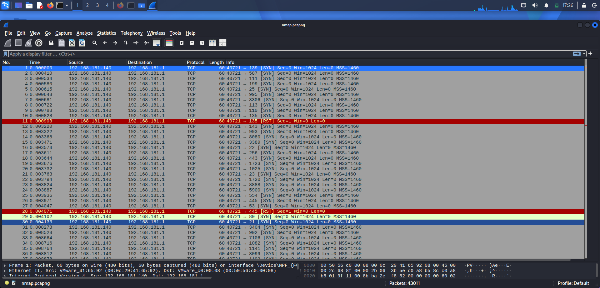
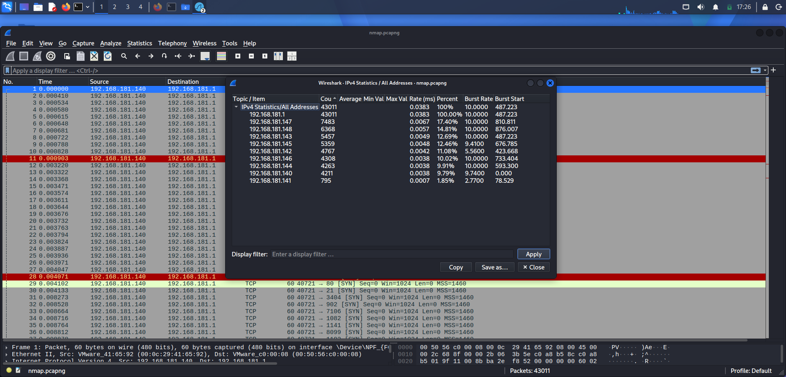
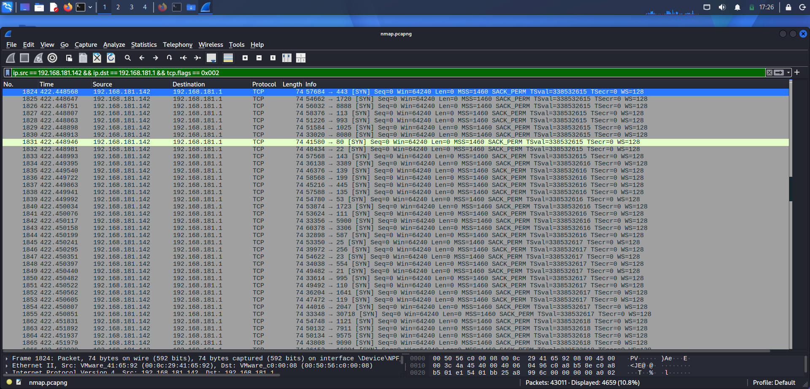
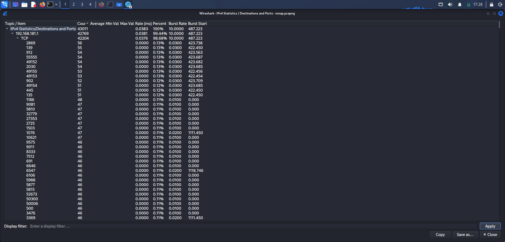
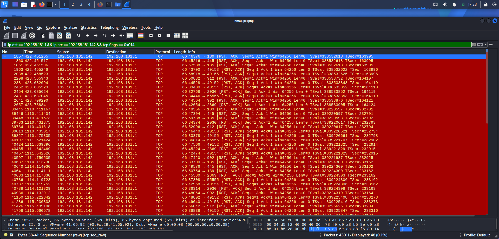

# Day 2 — TCP Port Scanning & Network Reconnaissance

## Objective

Investigate a publicly available network traffic capture containing port-scanning activity and determine, using packet-level evidence, whether systematic network reconnaissance occurred.

The investigation was performed using **Wireshark** without relying on the known description of the capture to determine the result.

The objective was to practice a SOC Analyst workflow:

> Observe → Form a hypothesis → Filter traffic → Investigate packet behavior → Validate the hypothesis → Document evidence

---

## Attack Investigated

| Field | Detail |
|---|---|
| **Activity** | TCP Port Scanning / Network Service Discovery |
| **PCAP** | `nmap.pcapng` |
| **Tool** | Wireshark |
| **Environment** | Kali Linux |
| **Total packets** | 43,011 |

> Note: this is described as "TCP Port Scanning / Network Service Discovery," not "Nmap attack." The PCAP filename references Nmap, but the capture itself does not independently establish which tool generated the traffic — see Section 12.

**Source:** [Zenodo Record 3558350](https://zenodo.org/records/3558350)

---

## 1. Initial PCAP Observation

The capture contained **43,011 packets** and multiple internal hosts communicating within the `192.168.181.0/24` network.

The initial investigation did not assume which host was the scanner. Endpoint and traffic statistics were examined first to identify hosts that warranted further investigation.

**Evidence**


*Screenshot_2026-08-19_17_26_01.png*

---

## 2. Endpoint / Host Activity Analysis

The IPv4 statistics showed that `192.168.181.1` accounted for the majority of packets in the capture, while several other hosts generated substantial amounts of traffic.

| Host | Packets |
|---|---:|
| `192.168.181.1` | 43,011 |
| `192.168.181.147` | 7,483 |
| `192.168.181.148` | 6,368 |
| `192.168.181.143` | 5,457 |
| `192.168.181.145` | 5,359 |
| `192.168.181.142` | 4,767 |
| `192.168.181.146` | 4,308 |
| `192.168.181.144` | 4,263 |
| `192.168.181.140` | 4,211 |
| `192.168.181.141` | 795 |

At this stage, these statistics were treated as **investigation leads rather than attacker/victim identification**.

**Evidence**


*Screenshot_2026-08-19_17_26_28.png*

---

## 3. Identifying the Scanning Traffic

The investigation was narrowed to traffic between:

- **Source:** `192.168.181.142`
- **Destination:** `192.168.181.1`

Filter used:

```text
ip.src == 192.168.181.142 && ip.dst == 192.168.181.1 && tcp.flags == 0x002
```

`0x002` isolates SYN-only packets — the pattern used to identify half-open scan probes, since a scanner typically sends a bare SYN without completing the handshake.

**Evidence**


*Screenshot_2026-08-19_17_26_44.png*

---

## 4. Destination Port Analysis

The SYN traffic was not concentrated on a single service. The source repeatedly targeted different TCP destination ports on the same destination host.

Examples observed:

```
TCP/22    TCP/23    TCP/25    TCP/53    TCP/80
TCP/110   TCP/111   TCP/135   TCP/139   TCP/143
TCP/443   TCP/445   TCP/993   TCP/1025  TCP/3306
TCP/3389  TCP/5900  TCP/8080  TCP/8888  TCP/12000
...and many others
```

**Approximately 3,690 unique TCP destination ports** were targeted by the source.

This pattern is significantly different from normal application communication, where a host typically communicates with a small number of known service ports.

**Evidence**


*Screenshot_2026-08-19_17_28_11.png*

---

## 5. TCP Response Analysis

The next step was determining how the target responded to the SYN probes.

No completed TCP connections were identified between `192.168.181.142 → 192.168.181.1`.

RST/ACK responses from the target were identified for some probes.

Filter used:

```text
ip.dst == 192.168.181.1 && ip.src == 192.168.181.142 && tcp.flags == 0x014
```

`0x014` represents **RST + ACK**.

**Evidence**


*Screenshot_2026-08-19_17_28_51.png*

---

## 6. TCP Connection Completion

A check was performed for completed TCP connections between the probing source and target. **No completed TCP connections were identified during the investigation.**

This is important: the observed traffic consists primarily of connection attempts rather than established application sessions. This supports reconnaissance/service discovery rather than successful interaction with the discovered services.

---

## 7. UDP / ICMP Observation

UDP probing activity was also identified. The target responded with:

- **ICMP Type:** 3 — Destination Unreachable
- **ICMP Code:** 3 — Port Unreachable
- **Source:** `192.168.181.1`
- **Destination:** `192.168.181.142`

This indicates at least one UDP destination port probed by the source was reported as unreachable. This ICMP observation is treated separately from the TCP SYN scanning evidence.

---

## 8. Investigation Methodology

A progressive filtering approach was used rather than immediately assuming the identity of the attacker.

```
Step 1 — Establish baseline
   (packet count, IPv4 hosts, traffic volume, packet direction)
        ↓
Step 2 — Identify suspicious communication
   (hosts generating substantial outbound traffic)
        ↓
Step 3 — Determine traffic direction
   (which host initiated connection attempts)
        ↓
Step 4 — Analyze TCP flags
   (repeated SYN-only packets)
        ↓
Step 5 — Analyze destination-port diversity
   (was the source targeting many different service ports?)
        ↓
Step 6 — Analyze responses
   (SYN/ACK, RST/ACK, no response, completed connections)
        ↓
Step 7 — Correlate additional protocols
   (UDP and ICMP probing behavior)
```

---

## 9. Key Findings

| Finding | Result |
|---|---|
| PCAP size | 43,011 packets |
| Apparent probing source | `192.168.181.142` |
| Apparent target | `192.168.181.1` |
| TCP SYN-only probes | 4,659 |
| Unique TCP destination ports | ~3,690 |
| Completed TCP connections | 0 observed |
| RST/ACK responses | 96 observed overall |
| UDP probing | Observed |
| ICMP response | Type 3 / Code 3 |
| Activity classification | Network reconnaissance / port scanning |

---

## 10. Analysis

The strongest evidence for port scanning is the combination of:

- A single source repeatedly targeting the same destination.
- Thousands of TCP SYN-only packets.
- Thousands of different destination ports.
- No completed TCP connections.
- RST/ACK responses to some probes.
- Additional UDP probing activity.

The behavior is therefore highly indicative of systematic network service discovery / port scanning.

**Language note:** the source host is described as the *apparent* scanning/probing source, not definitively as an "attacker" — a PCAP demonstrates network behavior but does not by itself establish intent or authorization.

---

## 11. What the PCAP Proves

- `192.168.181.142` generated extensive TCP SYN probing traffic.
- `192.168.181.1` was the apparent target of those probes.
- Thousands of TCP destination ports were targeted.
- No completed TCP connections were observed.
- Some probes resulted in RST/ACK responses.
- UDP probing was also present.
- An ICMP Type 3 Code 3 response was observed.

---

## 12. What the PCAP Does NOT Prove

- That `192.168.181.142` was controlled by an attacker.
- That the scanning activity was unauthorized.
- That any service on the target was successfully compromised.
- That every probed TCP port was closed.
- The exact Nmap command or scan option used.
- That exploitation occurred after the reconnaissance.

Observed behavior should not be confused with attacker intent or successful compromise. This is why the report title and body use "TCP Port Scanning / Network Service Discovery" rather than asserting a specific tool or hostile intent.

---

## 13. SOC Analyst Detection Logic

```
Single source IP
        ↓
Repeated TCP SYN packets
        ↓
Same destination / multiple destinations
        ↓
High destination-port diversity
        ↓
Low connection-completion rate
        ↓
RST/ACK or lack of responses
        ↓
Possible reconnaissance activity
```

Useful network telemetry for this type of investigation:

- Wireshark
- Network IDS/IPS
- Firewall logs
- NetFlow
- Zeek
- SIEM network telemetry

---

## 14. Example SOC Investigation Questions

| Question | What to check |
|---|---|
| Who initiated the traffic? | Source IP generating connection attempts |
| Who was targeted? | Destination IP or range |
| How many ports were targeted? | Destination-port diversity |
| What TCP flags were used? | SYN-only traffic indicates connection probing |
| Did the target respond? | SYN/ACK, RST/ACK, ICMP, or no response |
| Did any connection complete? | Large numbers of attempts without established sessions suggest scanning |
| Was the activity isolated? | Did the source contact multiple hosts, or do multiple hosts show similar behavior? |
| Is the source authorized? | Requires context outside the PCAP — asset inventory, scheduled security testing, SIEM/EDR |

---

## 15. MITRE ATT&CK Mapping

| Tactic | Technique | ID |
|---|---|---|
| Discovery | Network Service Discovery | [T1046](https://attack.mitre.org/techniques/T1046/) |

The observed behavior — a single internal host systematically probing thousands of TCP ports on another internal host, with no completed connections — is consistent with an adversary or authorized security tool enumerating accessible network services (T1046).

Because both `192.168.181.142` and `192.168.181.1` sit in the same internal subnet (`192.168.181.0/24`), this is classified as internal Discovery-phase activity rather than external pre-attack reconnaissance (which would map to T1595 — Active Scanning instead). If you later confirm the network topology places one host outside the perimeter, revisit this classification.

---

## 16. Lessons Learned

1. **Don't identify an attacker from endpoint statistics alone** — endpoint statistics provide investigation candidates, not attacker/victim roles.
2. **Packet behavior establishes the role** — the repeated `192.168.181.142 → 192.168.181.1` SYN pattern is what characterized `.142` as the apparent probing source, not its packet volume.
3. **High packet volume alone is not an IOC** — a legitimate server can generate enormous traffic; behavior and context matter more.
4. **No response does not automatically mean "closed"** — a missing response could result from filtering, packet loss, or other network conditions.
5. **Reconnaissance is not compromise** — detecting a port scan does not mean the target was successfully attacked.

---

## 17. Investigation Conclusion

The PCAP contains strong evidence of TCP port-scanning / network service discovery activity originating from `192.168.181.142` and targeting `192.168.181.1`.

The source generated **4,659 SYN-only TCP probes** across approximately **3,690 unique TCP destination ports**, with no completed TCP connections observed. Additional UDP probing and an ICMP Type 3 Code 3 response were also identified.

**Classification:** High-confidence network reconnaissance / port scanning.

The capture alone does not establish attacker intent, authorization status, or successful compromise.

---

## Folder Structure

```
day02-port-scanning/
├── README.md
├── Screenshot_2026-08-19_17_26_01.png
├── Screenshot_2026-08-19_17_26_28.png
├── Screenshot_2026-08-19_17_26_44.png
├── Screenshot_2026-08-19_17_28_11.png
└── Screenshot_2026-08-19_17_28_51.png
```

Do not commit `nmap.pcapng` itself — it's a public dataset; link or reference the original source instead of bloating the repo with the raw capture file.

---

## Disclaimer

This investigation was performed using a publicly available network traffic capture for cybersecurity education and defensive security training. The analysis is intended to demonstrate network traffic investigation techniques using Wireshark and should not be interpreted as evidence of malicious intent by the systems represented in the capture.

**Dataset attribution:** [Zenodo Record 3558350](https://zenodo.org/records/3558350)
