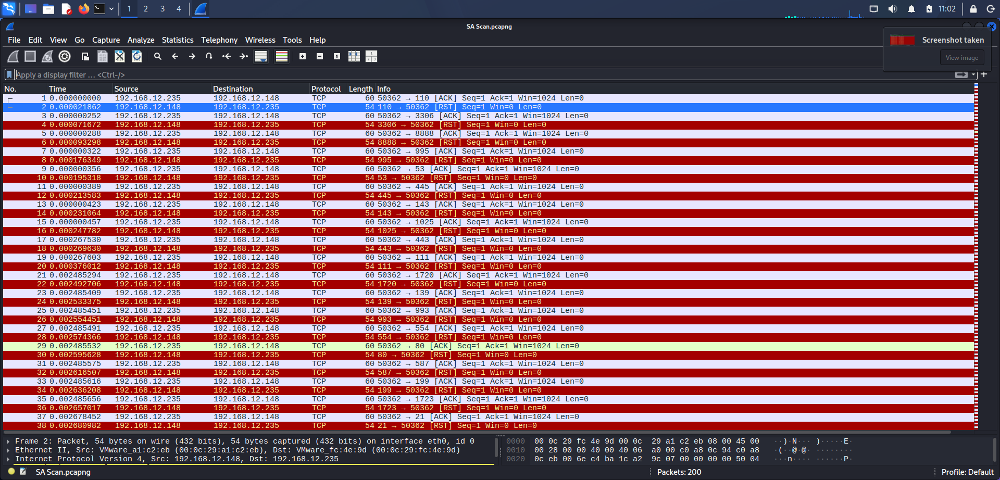
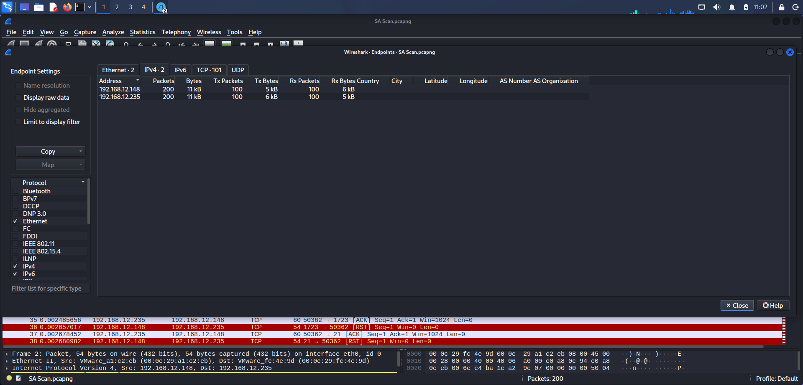
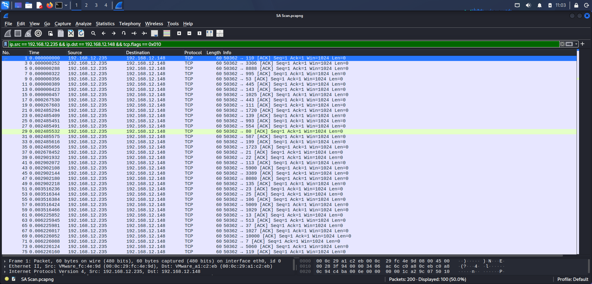
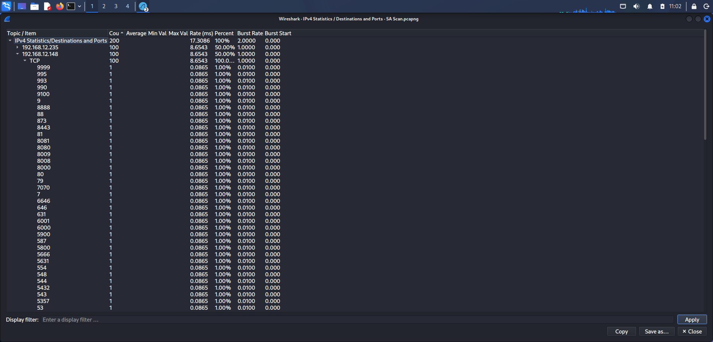
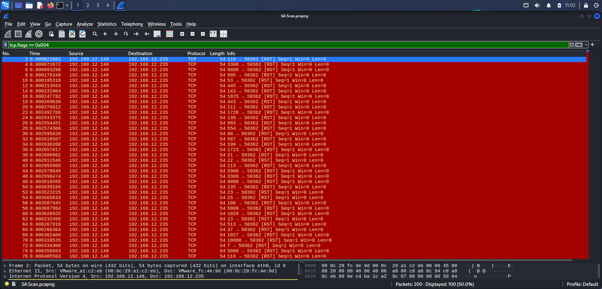

# Day 3 — TCP ACK Scan & Firewall Filtering Reconnaissance

## Objective

Investigate a publicly available network traffic capture using Wireshark to identify and understand TCP ACK-based reconnaissance.

The investigation was performed without relying on the known description of the capture. The objective was to determine the behavior from packet-level evidence and understand how a SOC analyst could distinguish ACK-based reconnaissance from normal TCP communication.

The investigation followed a progressive methodology:

> Establish baseline → Identify hosts → Analyze TCP flags → Examine destination-port diversity → Analyze responses → Determine scan behavior → Assess maliciousness

---

## 1. Attack Investigated

| Field | Detail |
|---|---|
| **Attack** | TCP ACK Scan / Firewall Filtering Reconnaissance |
| **PCAP** | `SA Scan.pcapng` |
| **Tool** | Wireshark |
| **Total packets** | 200 |

---

## 2. Initial Observation

The capture contained only two IPv4 hosts and TCP traffic:

```
192.168.12.235
192.168.12.148
```

Initial inspection showed an unusual alternating packet pattern:

```
192.168.12.235 → 192.168.12.148   TCP ACK
192.168.12.148 → 192.168.12.235   TCP RST
```

No TCP SYN packets were observed. This immediately suggested that the traffic was not a conventional TCP connection establishment pattern.

**Evidence**


*Screenshot_2026-08-24_11_02_17.png — alternating ACK probes from 192.168.12.235 and RST responses from 192.168.12.148*

---

## 3. Host Identification

| Host | Observed Role |
|---|---|
| `192.168.12.235` | Apparent probing/scanning source |
| `192.168.12.148` | Apparent target |

The roles were assigned based on packet behavior rather than endpoint statistics alone. The source host repeatedly generated TCP ACK probes toward the target across multiple destination ports.

**Evidence**


*Screenshot_2026-08-24_11_02_31.png — the two endpoints involved in the capture and their packet statistics*

---

## 4. TCP Flag Analysis

First packet observed:

```
Source:            192.168.12.235
Destination:        192.168.12.148
Source Port:        50362
Destination Port:   110
TCP Flag:            ACK
```

Target response:

```
Source:            192.168.12.148
Destination:        192.168.12.235
Source Port:        3306
Destination Port:   50362
TCP Flag:            RST
```

The same general ACK → RST pattern repeated throughout the capture.

---

## 5. SYN Analysis

Filters used to determine whether this was a conventional SYN-based scan:

```text
tcp.flags.syn == 1
```
**Result:** 0 packets

```text
tcp.flags.syn == 1 && tcp.flags.ack == 0
```
**Result:** 0 packets

This is significant — the traffic does not use SYN packets to initiate connections. The source is generating ACK-only probes instead.

---

## 6. ACK Probe Analysis

Filter used:

```text
tcp.flags == 0x010
```

`0x010` represents the TCP ACK flag.

**Result: 100 ACK-only probes**, originating from `192.168.12.235` and targeting `192.168.12.148`.

**Evidence**


*Screenshot_2026-08-24_11_03_22.png — the 100 ACK-only probes sent from 192.168.12.235 to 192.168.12.148*

---

## 7. Destination Port Analysis

The ACK probes were not repeatedly targeting one service. Instead, they were distributed across **100 unique TCP destination ports**.

Examples observed:

```
21    22    23    25    26    37    53    79    80    81
88    110   111   113   119   135   139   143   179   443
445   465   513   514   515   524   543   544   548   587
631   646   873   993   995   1025  1026  1027  1028  1029
1110  1433  1720  1723  1755  1900  2000  2001  2049  2121
2717  3000  3128  3306  3389  3986  4045  4899  5000  5009
5051  5060  5101  5190  5357  5432  554   5631  5666  5800
5900  6000  6001  6646  7070  8000  8008  8009  8080  8081
8443  8888  9100  9999  ...
```

The important observation is not the individual port numbers — it's that **one source systematically sent ACK probes to many different TCP destination ports on the same target.**

**Evidence**


*Screenshot_2026-08-24_11_02_52.png — destination-port statistics showing 100 TCP ports contacted on 192.168.12.148*

---

## 8. RST Response Analysis

Filter used:

```text
tcp.flags == 0x004
```

`0x004` represents the TCP RST flag.

**Result: 100 RST-only packets.**

Observed pattern:

```
ACK probe
    ↓
RST response
```

repeated across the capture.

**Evidence**


*Screenshot_2026-08-24_11_02_10.png — RST responses from 192.168.12.148 to 192.168.12.235*

---

## 9. TCP ACK Scan Pattern

```
                    TCP ACK
192.168.12.235 ───────────────────> 192.168.12.148
                  Port X

                    TCP RST
192.168.12.148 ───────────────────> 192.168.12.235


                    TCP ACK
192.168.12.235 ───────────────────> 192.168.12.148
                  Port Y

                    TCP RST
192.168.12.148 ───────────────────> 192.168.12.235
```

This pattern repeats for approximately 100 destination ports.

---

## 10. Why This Is Different From a SYN Scan

A conventional TCP SYN scan typically produces:

```
SYN
 ↓
SYN/ACK or RST
```

The traffic observed here is different:

```
ACK
 ↓
RST
```

| Metric | Count |
|---|---:|
| SYN packets | 0 |
| SYN-only packets | 0 |
| ACK-only probes | 100 |
| RST-only responses | 100 |

This should **not** be classified as the SYN scanning behavior investigated on Day 2. The traffic is consistent with TCP ACK-based reconnaissance.

---

## 11. Purpose of an ACK Scan

TCP ACK scanning is primarily useful for investigating firewall/filtering behavior. Unlike a SYN scan, an ACK scan does not directly determine whether a TCP service is open — instead, the scanner observes how the network responds to unsolicited ACK packets.

Simplified interpretation:

- `ACK → RST` → the probe reached the destination and received a TCP response.
- `ACK → No response` → may indicate packet filtering or another network condition.

ACK scanning is therefore useful for determining whether traffic appears to be filtered by a firewall or packet-filtering device — not for identifying open ports.

---

## 12. Important Interpretation

The RST responses should **not** be interpreted as "the ports are open." That conclusion would be incorrect.

The capture demonstrates that the target responded to the unsolicited ACK probes with RST packets. The investigation therefore focuses on **firewall/filtering behavior and network reconnaissance**, rather than identifying open application services.

---

## 13. Investigation Methodology

```
Step 1 — Establish baseline
   (total packet count, IPv4 endpoints, protocols, communication direction)
        ↓
Step 2 — Identify TCP behavior
   (capture contained only TCP traffic)
        ↓
Step 3 — Analyze TCP flags
   (SYN, SYN/ACK, ACK, RST)
        ↓
Step 4 — Identify probe type
   (source generated ACK-only packets, not SYN packets)
        ↓
Step 5 — Analyze destination ports
   (ACK probes targeted 100 different TCP destination ports)
        ↓
Step 6 — Analyze responses
   (target generated 100 RST-only responses)
        ↓
Step 7 — Determine behavior
   (pattern consistent with TCP ACK-based reconnaissance)
```

---

## 14. Evidence Summary

| Evidence | Result |
|---|---|
| Total packets | 200 |
| Hosts | 2 |
| Protocol | TCP |
| Source | `192.168.12.235` |
| Target | `192.168.12.148` |
| SYN packets | 0 |
| SYN-only packets | 0 |
| ACK-only probes | 100 |
| Unique destination ports | 100 |
| RST-only responses | 100 |
| Completed TCP handshakes | None observed |
| Observed pattern | ACK → RST |

---

## 15. Is the Source Malicious?

The traffic is clearly suspicious reconnaissance behavior, but the PCAP alone does not prove malicious intent.

`192.168.12.235` could represent:

- A compromised workstation
- An authorized vulnerability scanner
- A penetration-testing system
- A security assessment workstation
- An administrator performing network testing
- Another legitimate security tool

**Classification supported by the evidence:** TCP ACK-based network reconnaissance detected.

**Not proven by the evidence:** that `192.168.12.235` is an attacker-controlled or compromised host.

---

## 16. SOC Investigation After Detection

If this alert appeared in a production SOC, the next step would be contextual enrichment.

**Asset Identification**
`IP → Hostname → Asset Owner → System Role`

**Authorization Check** — determine whether the host is:
- An approved vulnerability scanner
- A penetration-testing system
- Part of a scheduled security assessment
- An unauthorized workstation

**Endpoint Investigation** — if telemetry is available, check for processes such as `nmap`, `masscan`, `hping3`, `unicornscan`, or custom scanning tools.

**Network Correlation** — check whether the same source subsequently:
- Scanned additional hosts
- Attempted authentication
- Connected to SMB/RDP/SSH
- Accessed administrative services
- Generated exploitation traffic

**Timeline Correlation** — the most useful question: *what happened before and after the reconnaissance?* Reconnaissance followed by credential attacks, exploitation, or lateral movement would substantially increase the likelihood of malicious activity.

---

## 17. What the PCAP Proves

- `192.168.12.235` generated TCP ACK-only probes.
- The probes targeted `192.168.12.148`.
- 100 unique destination ports were targeted.
- The target returned 100 TCP RST-only responses.
- No SYN packets were observed.
- The traffic pattern is consistent with TCP ACK-based reconnaissance.
- The activity can be used to assess network filtering behavior.

---

## 18. What the PCAP Does NOT Prove

- That `192.168.12.235` is compromised.
- That the source is controlled by an attacker.
- That the scanning was unauthorized.
- That any service was successfully exploited.
- That the target was compromised.
- That the target ports were open or closed based solely on the RST responses.
- The exact Nmap command used to generate the traffic.

Detecting reconnaissance is not the same as attributing malicious intent.

---

## 19. MITRE ATT&CK Mapping

| Tactic | Technique | ID |
|---|---|---|
| Discovery | Network Service Discovery | [T1046](https://attack.mitre.org/techniques/T1046/) |

The observed activity is consistent with network service discovery/reconnaissance through systematic probing of TCP ports. Both hosts (`192.168.12.235`, `192.168.12.148`) are internal, consistent with an internal Discovery-phase mapping — same reasoning applied in the Day 2 report.

---

## 20. Interview Perspective

**Question:** How would you investigate a suspected TCP ACK scan?

**Answer:** I would first examine the source and destination hosts and then analyze the TCP flags rather than assuming the activity is a conventional SYN scan. I would check whether the source is generating ACK-only packets across multiple destination ports and examine how the target responds — RSTs versus no response, since that provides information about network filtering.

In this capture, `192.168.12.235` generated 100 ACK-only probes against `192.168.12.148`, targeting 100 unique TCP ports. The target responded with 100 RST-only packets, and no SYN packets were observed.

That pattern is consistent with TCP ACK-based reconnaissance used to assess filtering behavior. I would then correlate the source IP with asset inventory, vulnerability-scanning records, authorization records, and endpoint telemetry before determining whether the activity was malicious.

---

## 21. Key Lessons Learned

1. **Don't assume SYN scanning** — not every TCP scan uses SYN packets.
2. **TCP flags reveal scan behavior** — the absence of SYN combined with repeated ACK-only probes was the key clue.
3. **RST responses matter** — the target repeatedly reset unsolicited ACK probes, showing the probes reached the target and generated TCP responses.
4. **ACK scans are different from SYN scans** — an ACK scan primarily helps assess filtering behavior rather than directly identifying open ports.
5. **Suspicious does not automatically mean malicious** — the network behavior is reconnaissance, but asset context is required to establish whether the activity is unauthorized or malicious.

---

## 22. Final Conclusion

The investigation identified a systematic TCP ACK probing pattern originating from `192.168.12.235` and targeting `192.168.12.148`.

The source generated **100 ACK-only TCP probes** across **100 unique destination ports**. The target responded with **100 RST-only packets**. No SYN packets were observed.

The behavior is highly consistent with TCP ACK-based reconnaissance used to assess firewall/filtering behavior. The source should be classified as the apparent probing/scanning host, while determining whether the activity was malicious requires additional contextual and endpoint evidence.

---

## Evidence

| # | Screenshot | Content |
|---|---|---|
| 1 | `Screenshot_2026-08-24_11_02_17.png` | Alternating ACK probes / RST responses (initial observation) |
| 2 | `Screenshot_2026-08-24_11_02_31.png` | IPv4 endpoint statistics |
| 3 | `Screenshot_2026-08-24_11_03_22.png` | 100 ACK-only probes |
| 4 | `Screenshot_2026-08-24_11_02_52.png` | Destination-port statistics — 100 ports |
| 5 | `Screenshot_2026-08-24_11_02_10.png` | RST responses |

---

## Folder Structure

```
day03-ack-scan/
├── README.md
├── Screenshot_2026-08-24_11_02_10.png
├── Screenshot_2026-08-24_11_02_17.png
├── Screenshot_2026-08-24_11_02_31.png
├── Screenshot_2026-08-24_11_02_52.png
└── Screenshot_2026-08-24_11_03_22.png
```

Do not commit `SA Scan.pcapng` itself — reference the source repository instead.

---

## PCAP Source

The `SA Scan.pcapng` capture was obtained from the publicly available **Nmap and Wireshark Lab**.

**Source repository:** https://github.com/Ryan-Sapone/Nmap-and-Wireshark-Lab

The PCAP was independently investigated in Wireshark for this exercise.

---

## Disclaimer

This investigation was performed using a publicly available network traffic capture for cybersecurity education and defensive security training. No unauthorized systems were targeted as part of this investigation. The conclusions documented here are limited to the network evidence available in the PCAP.
