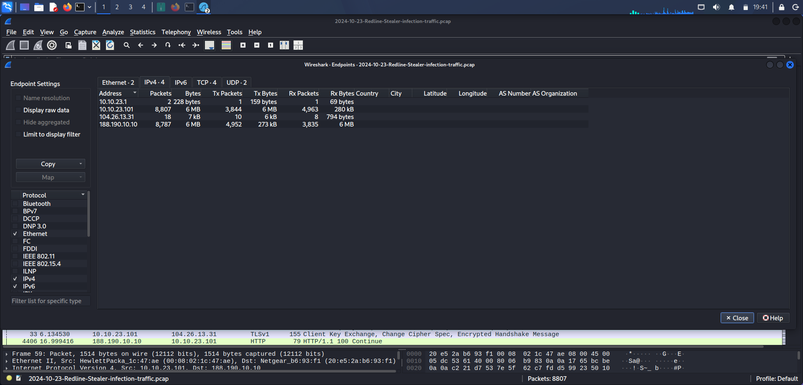
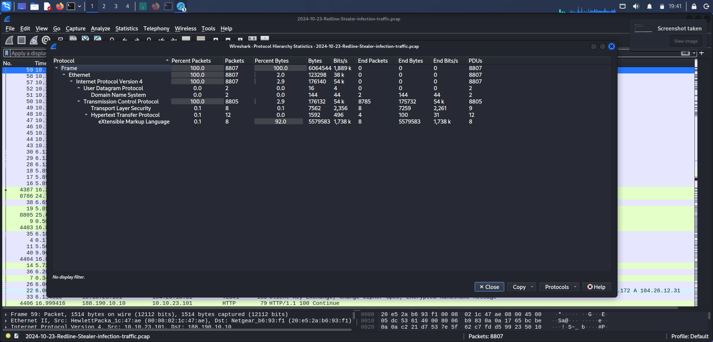
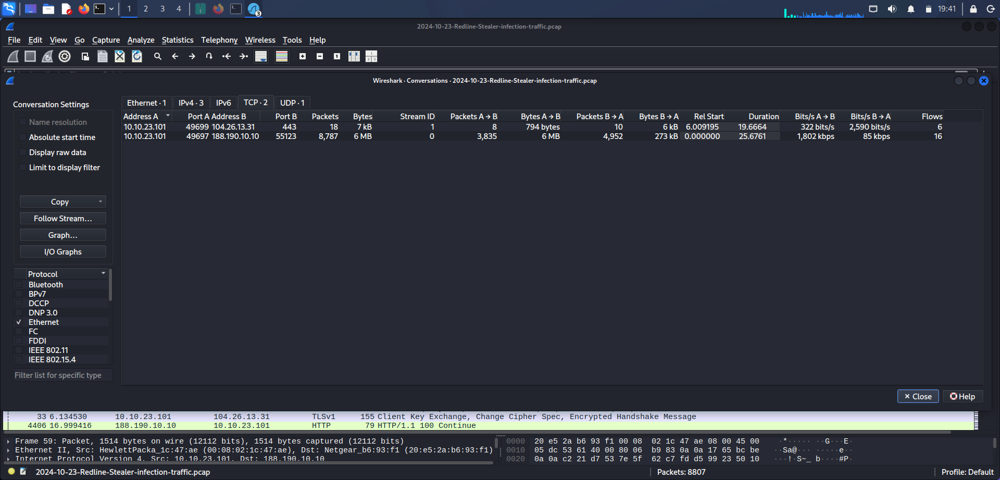
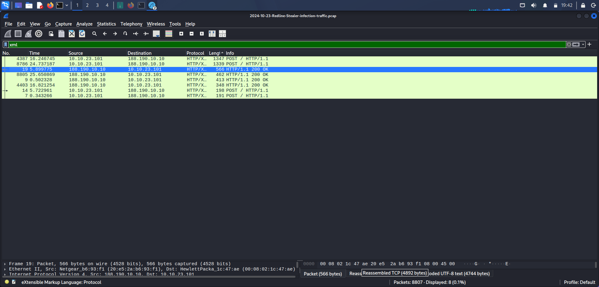
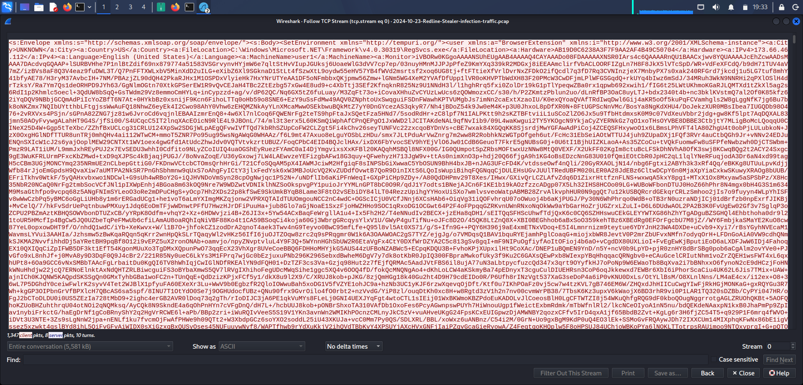
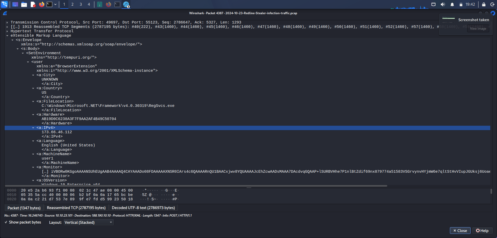
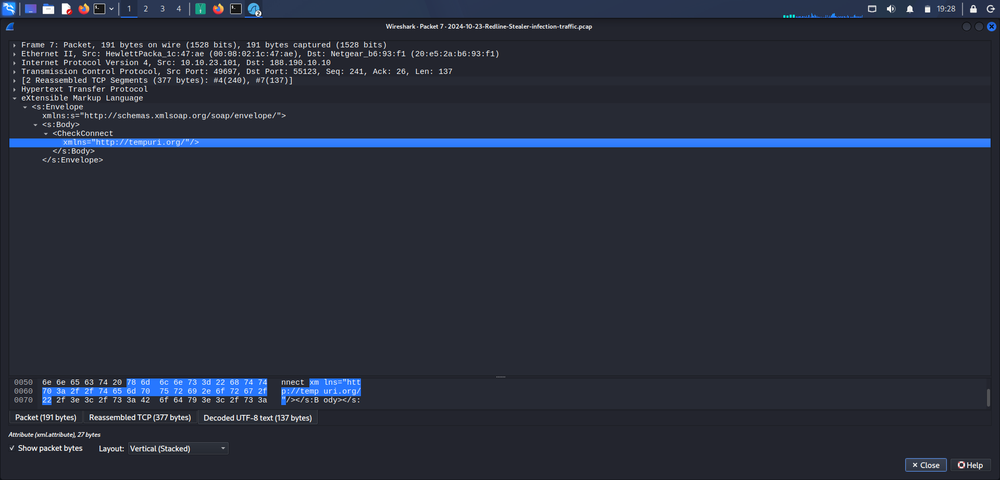

# Day 6 — C2 / Application-Layer Traffic Investigation

## Case Information

| Field | Details |
|---|---|
| **Investigation Type** | Suspicious C2 / Application-Layer Traffic Investigation |
| **Case** | Case 05 – C2 Traffic Investigation |
| **PCAP** | `2024-10-23-Redline-Stealer-infection-traffic.pcap` |
| **Total Packets** | 8,807 |
| **Suspected Internal Host** | `10.10.23.101` |
| **Primary External Endpoint** | `188.190.10.10` |
| **Primary Destination Port** | 55123 |

> **Note on the filename:** the capture file is named `2024-10-23-Redline-Stealer-infection-traffic.pcap`, which identifies this as documented **Redline Stealer** traffic — a well-known commodity infostealer. Consistent with the methodology used across this series (Day 1's principle of not relying on a capture's known description to shape the analysis), the investigation below was conducted blind, from packet-level evidence only. The filename is treated as separate contextual information, not as evidence in itself, and is called out here rather than left implicit.

---

## 1. Objective

The objective of this investigation was to analyze network traffic captured in a PCAP file and identify suspicious communication potentially associated with malware command-and-control activity.

The investigation focused on:

1. Identifying the primary communicating hosts.
2. Reviewing protocol distribution.
3. Analyzing network conversations.
4. Identifying unusual ports and communication patterns.
5. Inspecting the largest TCP stream.
6. Examining application-layer content.
7. Determining whether the available evidence supported a C2-related conclusion.

---

## 2. Network Overview

The PCAP contained 8,807 packets involving the following primary endpoints:

| Address | Packets | Bytes |
|---|---:|---:|
| `10.10.23.1` | 2 | 228 |
| `10.10.23.101` | 8,807 | 6,064,544 |
| `104.26.13.31` | 18 | 7,162 |
| `188.190.10.10` | 8,787 | 6,057,154 |

The traffic was heavily dominated by communication involving `10.10.23.101 ↔ 188.190.10.10`. This conversation accounted for 8,787 packets, making it the primary communication observed in the capture.

**Evidence**


*Screenshot_2026-08-31_19_41_36(1).png — Wireshark Endpoints statistics showing the main communicating hosts and traffic volume*

---

## 3. Protocol Analysis

The protocol hierarchy showed that the traffic was primarily TCP-based.

Key observed protocols: TCP, DNS, TLS, HTTP, XML.

TCP accounted for approximately 99.98% of packets in the capture.

A notable observation was that **XML represented approximately 5.58 MB of application-layer data**, accounting for the majority of the captured traffic volume.

**Evidence**


*Screenshot_2026-08-31_19_41_43(1).png — Wireshark Protocol Hierarchy Statistics showing that most captured traffic was TCP/XML*

---

## 4. Conversation Analysis

**Primary conversation:**

| Field | Value |
|---|---|
| Source | `10.10.23.101` |
| Destination | `188.190.10.10` |
| Port | 55123 |
| Packets | 8,787 |
| Bytes | 6,057,154 |
| Duration | ~25.68 seconds |

Traffic direction showed a significant amount of data transmitted from the internal host to the external endpoint:

| Direction | Packets | Bytes |
|---|---:|---:|
| `10.10.23.101 → 188.190.10.10` | 3,835 | 5,783,689 |
| `188.190.10.10 → 10.10.23.101` | 4,952 | 273,465 |

This asymmetric communication pattern was notable — the internal host transmitted substantially more data than it received, roughly a 21:1 ratio by volume.

**Evidence**


*Screenshot_2026-08-31_19_41_54.png — Wireshark Conversations statistics showing the two main TCP conversations in the capture*

---

## 5. Suspicious TCP Communication

The primary TCP conversation was observed on:

```
10.10.23.101:49697 → 188.190.10.10:55123
```

Destination port 55123 was not associated with a clearly identified standard application protocol in the investigation.

The communication generated 8,787 packets, approximately 6.05 MB of traffic, and approximately 5.78 MB transmitted from the internal host to the external endpoint. This connection was selected for deeper inspection due to its dominant presence within the capture.

**Evidence**


*Screenshot_2026-08-31_19_42_45.png — filtered XML traffic showing HTTP POST requests and server responses*

---

## 6. Largest TCP Stream Analysis

The largest TCP stream was identified using:

```text
tcp.stream eq 0
```

The stream contained approximately **5.58 MB** of data and involved structured XML content.

Inspection using Follow TCP Stream revealed SOAP/XML-formatted messages. Observed operations included `<CheckConnect>` and `<SetEnvironment>`.

**Evidence**


*Screenshot_2026-08-31_19_33_47.png — Follow TCP Stream view showing the large reassembled client-server XML data stream*

---

## 7. Application-Layer Findings

The inspected TCP stream contained SOAP-formatted communication similar to:

```xml
<s:Envelope>
    <s:Body>
        <CheckConnect>
```

Another observed operation was `<SetEnvironment>`.

The large amount of structured XML traffic suggests that the communicating application was transmitting significant structured information between the internal host and the external endpoint.

However, the complete stream could not be manually reviewed to its end because of its large size and continuous loading behavior within Wireshark. The investigation therefore does **not** claim to have fully identified every field or the complete contents of the transmitted data.

**Evidence**


*Screenshot_2026-08-31_19_42_53.png — detailed inspection of the large XML/SOAP POST packet containing host information and transmitted data*


*Screenshot_2026-08-31_19_28_28.png — detailed inspection of an XML/SOAP CheckConnect request between the internal host and external server*

---

## 8. Key Indicators

| Indicator | Value |
|---|---|
| Suspected Internal Host | `10.10.23.101` |
| Primary External Endpoint | `188.190.10.10` |
| Suspicious Connection | `10.10.23.101:49697 → 188.190.10.10:55123` |
| Relevant Wireshark Filter | `tcp.stream eq 0` |
| Observed Application-Layer Operations | `CheckConnect`, `SetEnvironment` |

---

## 9. Investigation Findings

The investigation identified a dominant TCP communication channel between `10.10.23.101` and `188.190.10.10:55123`.

Several characteristics made this communication suspicious:

- The conversation represented nearly all significant traffic in the capture.
- A large volume of data was transmitted from the internal host to the external endpoint.
- Communication occurred over TCP port 55123, not a standard well-known port.
- The largest TCP stream contained approximately 5.58 MB of structured SOAP/XML traffic.
- SOAP/XML operations including `CheckConnect` and `SetEnvironment` were observed.

These findings indicate substantial application-layer communication between the internal system and the external endpoint.

---

## 10. MITRE ATT&CK Mapping

| Tactic | Technique | ID |
|---|---|---|
| Command and Control | Application Layer Protocol: Web Protocols | [T1071.001](https://attack.mitre.org/techniques/T1071/001/) |
| Exfiltration | Exfiltration Over C2 Channel | [T1041](https://attack.mitre.org/techniques/T1041/) |

- **T1071.001** — the observed traffic used HTTP-carried SOAP/XML messaging over a non-standard port, consistent with an application layer protocol being used to blend C2-style communication into what superficially resembles web traffic.
- **T1041** — the strongly asymmetric data volume (5.78 MB outbound vs. 273 KB inbound) over the same channel used for the `CheckConnect`/`SetEnvironment` exchanges is consistent with exfiltration occurring over the same connection used for command traffic, rather than a separate exfil channel.

**Evidence limitation, consistent with prior days:** these mappings describe the observed network behavior. The PCAP does **not** independently confirm the exact purpose of the XML communication, that commands were issued and executed, that the transferred data contained sensitive information, that exfiltration in the ATT&CK sense actually occurred, or that any host-level malware action succeeded. Treat these as behaviorally consistent, not evidentially proven.

---

## 11. Conclusion

The investigation identified a high-volume TCP communication channel between `10.10.23.101` and `188.190.10.10:55123`. Approximately 6.05 MB of traffic was exchanged, with the majority of the data transmitted from the internal host to the external endpoint. Inspection of the largest TCP stream revealed structured SOAP/XML communication containing operations such as `CheckConnect` and `SetEnvironment`.

The observed behavior is suspicious and is consistent with possible malware-related application-layer communication. However, based solely on the available network capture, the exact purpose of the communication cannot be conclusively determined. The available evidence does not independently confirm command execution, successful C2 tasking, or data exfiltration.

---

## 12. Limitations

The investigation was limited to the available network traffic. The following could not be conclusively confirmed from the PCAP alone:

- The exact purpose of the XML communication.
- Whether commands were issued by the external endpoint.
- Whether the transferred data contained sensitive information.
- Whether data exfiltration occurred.
- Whether specific malware actions were successfully executed.

Additional endpoint telemetry, process information, file artifacts, or malware analysis would be required to confirm those activities.

---

## 13. Defensive Recommendations

1. Investigate the endpoint `10.10.23.101` for suspicious processes and persistence mechanisms.
2. Review endpoint logs for connections to `188.190.10.10`.
3. Search firewall and proxy logs for additional systems communicating with the same endpoint.
4. Investigate outbound connections to TCP port 55123.
5. Collect endpoint telemetry to determine which process initiated the communication.
6. Review the system for malware-related artifacts associated with the observed traffic.

---

## Evidence

| # | Screenshot | Content |
|---|---|---|
| 1 | `Screenshot_2026-08-31_19_41_36.png` | Wireshark Endpoints statistics |
| 2 | `Screenshot_2026-08-31_19_41_43.png` | Protocol Hierarchy statistics |
| 3 | `Screenshot_2026-08-31_19_41_54.png` | Conversations statistics |
| 4 | `Screenshot_2026-08-31_19_42_45.png` | Filtered XML traffic — HTTP POST requests |
| 5 | `Screenshot_2026-08-31_19_42_53.png` | XML/SOAP POST packet detail |
| 6 | `Screenshot_2026-08-31_19_33_47.png` | Follow TCP Stream — reassembled XML data |
| 7 | `Screenshot_2026-08-31_19_28_28.png` | XML/SOAP CheckConnect request detail |

---

## Folder Structure

```
day06-c2-traffic/
├── README.md
├── Screenshot_2026-08-31_19_41_36.png
├── Screenshot_2026-08-31_19_41_43.png
├── Screenshot_2026-08-31_19_41_54.png
├── Screenshot_2026-08-31_19_42_45.png
├── Screenshot_2026-08-31_19_42_53.png
├── Screenshot_2026-08-31_19_33_47.png
└── Screenshot_2026-08-31_19_28_28_2.png
```

Do not commit `2024-10-23-Redline-Stealer-infection-traffic.pcap` itself — reference the source repository instead.

---

## PCAP Source

**Source:** [Plaintext Security — Network Forensics Lab](https://www.plaintextsecurity.org/03-forensics/modules/09-network-forensics/lab/)

---

## Disclaimer

This investigation was performed using a publicly available network traffic capture for cybersecurity education and defensive security training. The conclusions documented here are limited to the network evidence available in the PCAP and do not confirm endpoint execution, exfiltration, or compromise.
