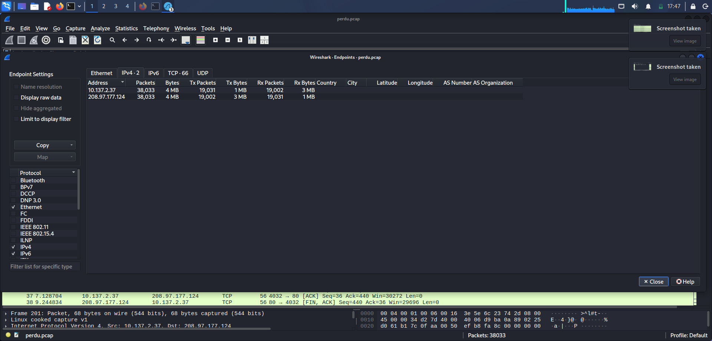
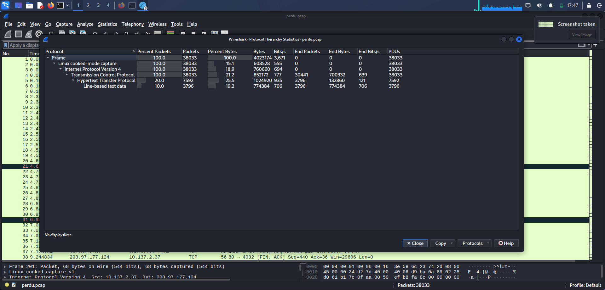
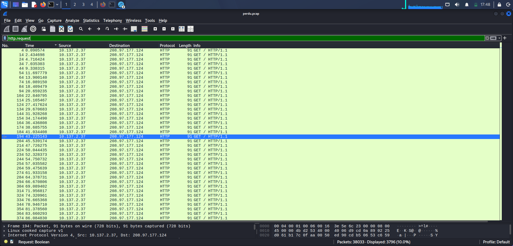
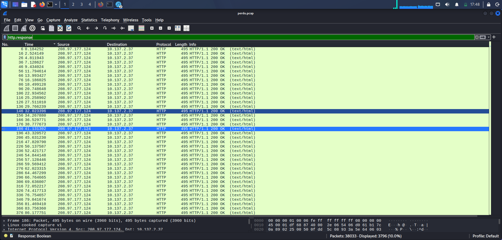
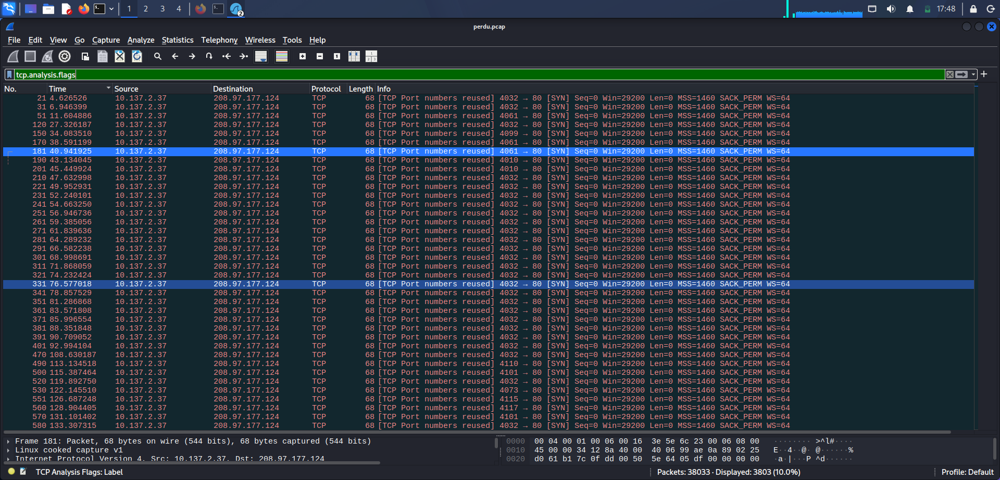
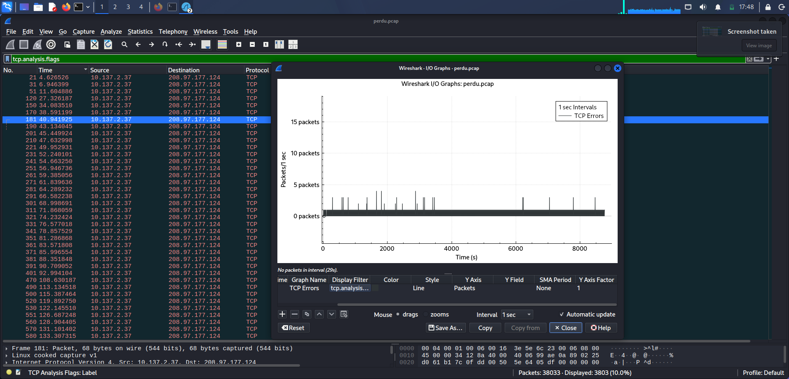
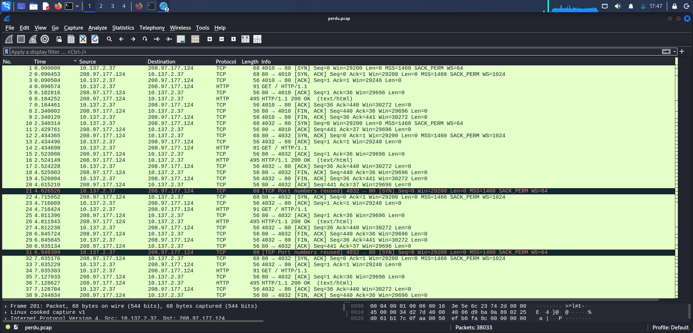

# Day 7 — PCAP Traffic Analysis: Perdu Forensic Challenge

## 1. Objective

The objective of this investigation was to analyze a PCAP file using Wireshark and identify unusual network behavior, HTTP activity, and potential indicators of hidden or suspicious data transmission.

---

## 2. PCAP Source

The PCAP used for this investigation is `perdu.pcap`, from the **NDH 2018 – Perdu** forensic challenge
```
Source: https://www.aperikube.fr/docs/ndh_2018/perdu/
```

The challenge describes the capture as containing potential evidence of hidden data transmission/exfiltration.

---

## 3. Capture Overview

| Attribute | Observation |
|---|---|
| Total packets | 38,033 |
| Total bytes | 4,023,174 |
| Primary client IP | `10.137.2.37` |
| Primary server IP | `208.97.177.124` |
| Transport protocol | TCP |
| Application protocol | HTTP |
| HTTP requests observed | 3,796 GET requests |
| HTTP POST requests | 0 |

The traffic statistics showed communication almost exclusively between `10.137.2.37 <----> 208.97.177.124`. The client generated HTTP requests to TCP port 80 on the remote server.

**Evidence**


*Screenshot_2026-09-01_17_47_39.png — Endpoints statistics identifying the communicating IP addresses and packet/byte distribution*

---

## 4. Protocol Analysis

```
Total Packets:                38,033
TCP Packets:                  38,033
HTTP Packets:                  7,592
HTTP GET Requests:             3,796
HTTP Responses:                3,796
Line-based Text Data:          3,796
```

This indicates a highly repetitive communication pattern consisting primarily of HTTP request-response exchanges.

**Evidence**


*Screenshot_2026-09-01_17_47_31.png — Protocol Hierarchy Statistics identifying the main protocols present in the PCAP*

---

## 5. HTTP Request Analysis

A representative request:

```http
GET / HTTP/1.1
Host: perdu.com
```

The first inspected HTTP requests used the same URI: `/`. No unusual URI paths were identified during the initial analysis.

```
Source IP:        10.137.2.37
Destination IP:   208.97.177.124
Destination Port: 80
Protocol:         HTTP
Method:           GET
URI:               /
Host:              perdu.com
```

**Evidence**


*Screenshot_2026-09-01_17_48_03.png — HTTP requests from the source host to the destination server*

---

## 6. HTTP Response Analysis

The server responded with `HTTP/1.1 200 OK`:

```
Content-Length: 204
Content-Type: text/html
Server: Apache
```

HTML content returned:

```html
<html>
<head>
<title>Vous Etes Perdu ?</title>
</head>
<body>
<h1>Perdu sur l'Internet ?</h1>
<h2>Pas de panique, on va vous aider</h2>
<strong>
<pre>    * <----- vous êtes ici</pre>
</strong>
</body>
</html>
```

Multiple HTTP responses were inspected, and the responses appeared to follow the same pattern and have the same packet length.

**Investigation decision:** based on the inspected responses, there was no evidence that hidden or suspicious information was contained in the visible HTTP response body. Repeatedly inspecting identical responses would not be an efficient investigation path, so the analysis moved to a different layer.

**Evidence**


*Screenshot_2026-09-01_17_48_16.png — HTTP responses returned by the destination server, primarily HTTP 200 OK*

---

## 7. TCP Analysis

The next phase focused on TCP-level behavior.

Filter used:

```text
tcp.analysis.flags
```

A large number of packets were marked with:

```
[TCP Port numbers reused]
4032 → 80 [SYN]
```

Another Wireshark diagnostic message observed:

```
A new tcp session is started with the same ports as an earlier session in this trace
```

This behavior was considered unusual and required further investigation.

**Evidence**


*Screenshot_2026-09-01_17_48_50.png — TCP analysis flags highlighting repeated TCP connections and port reuse events*

---

## 8. Observed Source Port Pattern

Client source ports showed a noticeable pattern. Examples:

```
4003   4009   4010   4011   4032
4061   4073   4099   4110   4115
```

The client repeatedly established HTTP connections using source ports primarily within a relatively narrow range.

```
10.137.2.37:<source-port>
        |
        | HTTP GET /
        v
208.97.177.124:80
```

This is more interesting than the HTTP payload itself because source port selection is normally treated as connection metadata rather than application content.

**Evidence**


*Screenshot_2026-09-01_17_48_57.png — Wireshark I/O Graph visualizing the occurrence of TCP analysis events over time*

---

## 9. Wireshark Investigation Workflow

**Traffic overview** — `Statistics → Conversations` identified the two primary communicating hosts.

**Protocol distribution** — `Statistics → Protocol Hierarchy` confirmed the capture consisted primarily of TCP and HTTP traffic.

**HTTP investigation** — filters used: `http.request`, `http.response`, `http.request.method == "GET"`

Findings: 3,796 GET requests, no POST requests, repeated requests to `/`, repetitive HTTP responses.

**TCP anomaly investigation** — filter used: `tcp.analysis.flags`

This revealed TCP port reuse warnings, repeated new TCP sessions, and reuse of port combinations.

**Evidence**


*Screenshot_2026-09-01_17_47_24.png — full packet capture overview and repeated TCP connections flagged with TCP analysis warnings*

---

## 10. Key Findings

- The capture contained 38,033 packets.
- Communication primarily occurred between `10.137.2.37` and `208.97.177.124`.
- The traffic consisted largely of repeated HTTP communication.
- The client generated 3,796 HTTP GET requests.
- No HTTP POST requests were observed.
- The HTTP URI repeatedly used was `/`.
- The HTTP server returned repetitive 200 OK responses containing the same webpage.
- The visible HTTP response content did not explain the suspicious behavior.
- TCP analysis revealed repeated port reuse warnings.
- The client source ports showed a structured pattern and became the primary area for further investigation.

---

## 11. Analyst Assessment

The most important lesson from this investigation was that suspicious information is not always present in the obvious application-layer payload.

Initially, HTTP traffic was investigated because the capture contained thousands of HTTP packets. However: GET requests were repetitive, the URI was always `/`, HTTP responses were repetitive, and response content was identical. Continuing to inspect the same HTTP payload would provide little additional value.

The TCP metadata provided a stronger investigative lead:

```
Repeated TCP sessions
        ↓
Port reuse warnings
        ↓
Structured source port values
        ↓
Potential hidden information in connection metadata
```

This demonstrates an important SOC and network forensics principle: when application-layer data appears repetitive or benign, analysts should also examine metadata such as ports, timing, packet sizes, session behavior, and protocol anomalies.

---

## 12. MITRE ATT&CK Mapping

| Tactic | Technique | ID |
|---|---|---|
| Defense Evasion | Data Obfuscation | [T1001](https://attack.mitre.org/techniques/T1001/) |

**Confidence note — lower than prior days:** unlike Day 5 (Base64-encoded DNS TXT payloads that decoded to explicit shell commands) or Day 6 (structured SOAP/XML with named operations), this investigation identified an *anomaly* in TCP source-port selection and session reuse — it did not decode or confirm what, if anything, is actually encoded in that metadata. T1001 (Data Obfuscation) is offered as the closest conceptual fit for "information potentially hidden within otherwise benign-looking traffic," but this mapping is speculative relative to the other days in this series and should be labeled as such if published. Do not present this with the same confidence level as the Day 5/6 mappings, where the payload itself was recovered and read.

---

## 13. Final Conclusion

The PCAP initially appears to contain simple repetitive HTTP traffic to `perdu.com`. However, deeper analysis identified abnormal TCP session behavior and repeated source-port reuse patterns.

The investigation showed that the visible HTTP payload was unlikely to be the primary location of suspicious information. TCP connection metadata, particularly the client source-port pattern, represented the strongest investigative lead.

The analysis shifted from:

```
HTTP Payload Analysis
        ↓
No significant variation
        ↓
TCP Session Analysis
        ↓
Port Reuse Detection
        ↓
Source Port Pattern Investigation
```

**Overall assessment:** the capture demonstrates why network investigations should not rely only on packet payloads. Connection metadata and protocol-level anomalies can provide critical evidence that is not visible at the application layer.

---

## Tools Used

- Wireshark
- Wireshark Protocol Hierarchy
- Wireshark Conversations
- HTTP display filters
- TCP analysis filters
- Wireshark I/O Graphs

---

## Evidence

| # | Screenshot | Content |
|---|---|---|
| 1 | `Screenshot_2026-09-01_17_47_24.png` | Full capture overview with TCP analysis warnings |
| 2 | `Screenshot_2026-09-01_17_47_31.png` | Protocol Hierarchy statistics |
| 3 | `Screenshot_2026-09-01_17_47_39.png` | Endpoints statistics |
| 4 | `Screenshot_2026-09-01_17_48_03.png` | HTTP requests |
| 5 | `Screenshot_2026-09-01_17_48_16.png` | HTTP responses |
| 6 | `Screenshot_2026-09-01_17_48_50.png` | TCP analysis flags — port reuse |
| 7 | `Screenshot_2026-09-01_17_48_57.png` | I/O Graph — TCP analysis events over time |

---

## Folder Structure

```
day07-perdu-covert-channel/
├── README.md
├── Screenshot_2026-09-01_17_47_24.png
├── Screenshot_2026-09-01_17_47_31.png
├── Screenshot_2026-09-01_17_47_39.png
├── Screenshot_2026-09-01_17_48_03.png
├── Screenshot_2026-09-01_17_48_16.png
├── Screenshot_2026-09-01_17_48_50.png
└── Screenshot_2026-09-01_17_48_57.png
```

Do not commit `perdu.pcap` itself — reference the challenge source page instead.

---

## Disclaimer

This investigation was performed using a publicly available network traffic capture (NDH 2018 CTF forensic challenge) for cybersecurity education and defensive security training. The conclusions documented here are limited to the network evidence available in the PCAP; the exact mechanism or content of any hidden data was not decoded as part of this write-up.
