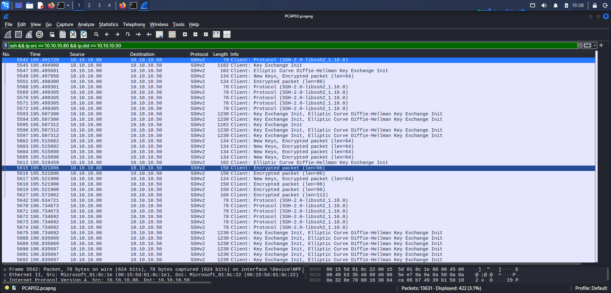
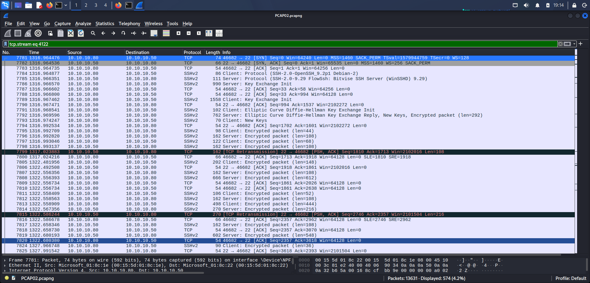

# Day 9 — SSH Brute-Force / Repeated SSH Connection Investigation

## Objective

Investigate suspicious SSH traffic between two internal hosts to determine whether the capture contains repeated SSH connection attempts and whether a long-lived SSH session was established.

The investigation focused on:

- Identifying the primary hosts involved
- Determining SSH client and server roles
- Measuring repeated connection attempts
- Examining TCP connection behavior
- Confirming SSH protocol and key-exchange activity
- Determining what the encrypted traffic can and cannot prove

---

## PCAP Information

| Field | Detail |
|---|---|
| **PCAP** | `PCAP02.pcapng` |
| **Challenge** | DEADFACE CTF 2023 — Creepy Crawling |
| **Investigation Tool** | Wireshark |

**Source:** https://cyberhacktics.sfo2.digitaloceanspaces.com/DEADFACECTF2023/Challenges/pcap/pcap02/PCAP02.pcapng

---

## Investigation Environment

- Kali Linux
- Wireshark
- `PCAP02.pcapng`

---

## 1. Initial Traffic Baseline

**Total packets:** 13,631

Endpoint statistics identified two dominant internal hosts:

| Host | Packets | Bytes |
|---|---:|---:|
| `10.10.10.80` | 11,638 | 1,836,477 |
| `10.10.10.50` | 11,687 | 1,840,597 |

Other observed addresses included broadcast and multicast traffic (`10.10.10.255`, `169.254.255.255`, `224.0.0.22`, `224.0.0.251`, `224.0.0.252`, `239.255.255.250`, `255.255.255.255`) — not investigated further, as they are not relevant to the SSH activity between the two dominant hosts.

The primary investigation therefore focused on communication between `10.10.10.80` and `10.10.10.50`.

---

## 2. SSH Traffic Identification

Filter applied:

```text
ssh
```

**Result:** 991 SSH packets, observed between `10.10.10.80 ↔ 10.10.10.50`.

Further TCP analysis established the host roles:

| Role | Host |
|---|---|
| SSH Client | `10.10.10.80` |
| SSH Server | `10.10.10.50` |
| SSH Server Port | 22 |

---

## 3. Repeated TCP Connection Attempts

Filter used to identify new TCP connection attempts from the SSH client:

```text
ip.src == 10.10.10.80 &&
ip.dst == 10.10.10.50 &&
tcp.flags.syn == 1 &&
tcp.flags.ack == 0 &&
tcp.dstport == 22
```

**Result: 4,272 client SYN packets.**

Corresponding server-side SYN/ACK filter:

```text
ip.src == 10.10.10.50 &&
ip.dst == 10.10.10.80 &&
tcp.flags.syn == 1 &&
tcp.flags.ack == 1 &&
tcp.srcport == 22
```

**Result: 202 server SYN/ACK packets.**

This demonstrates a large number of connection attempts from the client toward the SSH server, with a substantially smaller number of observed SYN/ACK responses.

> **Important caveat:** the difference between these numbers should not be interpreted as a number of failed login attempts. TCP connection attempts occur before SSH authentication — this gap reflects connection-level behavior, not authentication outcomes.

*(No screenshot provided for this section — filter results are documented as text evidence only.)*

---

## 4. TCP/22 Conversation Analysis

TCP conversation data showed numerous separate connections from `10.10.10.80` to `10.10.10.50:22` using rapidly changing ephemeral source ports. Examples:

```
36472 → 22   36480 → 22   36490 → 22   36504 → 22   36506 → 22
36518 → 22   36628 → 22   36632 → 22   36636 → 22   ...
41814 → 22   41822 → 22   41828 → 22   ...
57520 → 22   57522 → 22   ...
57670 → 22
```

Many of these connections contained only a small number of packets and short durations. This pattern is consistent with repeated automated connection activity against the SSH service.

---

## 5. SSH Protocol Analysis

Filter used:

```text
ssh &&
ip.src == 10.10.10.80 &&
ip.dst == 10.10.10.50
```

The filtered traffic contained repeated SSH protocol and key-exchange sequences. Observed client behavior:

```
Client: Protocol (SSH-2.0-libssh2_1.10.0)
Client: Key Exchange Init
Client: New Keys
Client: Encrypted packet
```

Multiple SSH protocol and key-exchange sequences occurred at different times in the capture, indicating repeated SSH connection establishment rather than a single isolated SSH exchange.

**Evidence**


*Screenshot_2026-09-03_19_08_37.png — repeated SSH protocol and key-exchange activity from 10.10.10.80 to 10.10.10.50*

---

## 6. Long-Lived SSH Session

A significant connection was identified:

| Field | Value |
|---|---|
| Source | `10.10.10.80:46682` |
| Destination | `10.10.10.50:22` |
| TCP Stream | 4122 |

Conversation statistics for this stream:

| Field | Value |
|---|---|
| Displayed packets | 153 |
| Total packets | 574 |
| Duration | ~1,048.58 seconds (~17.5 minutes) |

The stream began with a normal TCP three-way handshake:

```
10.10.10.80 → 10.10.10.50   SYN
10.10.10.50 → 10.10.10.80   SYN, ACK
10.10.10.80 → 10.10.10.50   ACK
```

---

## 7. SSH Handshake Details

SSH banners observed in the long-lived stream:

| Role | Banner |
|---|---|
| Client | `SSH-2.0-OpenSSH_3.2p1 Debian-2` |
| Server | `SSH-2.0-9.29 FlowSsh: Bitvise SSH Server (WinSSHD) 9.29` |

Negotiation sequence:

```
Client: Protocol
Server: Protocol

Client: Key Exchange Init
Server: Key Exchange Init

Client: Elliptic Curve Diffie-Hellman Key Exchange Init
Server: Elliptic Curve Diffie-Hellman Key Exchange Reply

New Keys
Encrypted packets
```

This confirms the connection progressed beyond the initial TCP handshake into an established SSH protocol exchange.

**Evidence**


*Screenshot_2026-09-03_19_14_03.png — TCP stream 4122 with the completed SSH handshake, SSH version banners, key exchange, and sustained encrypted traffic*

---

## 8. Encrypted SSH Traffic

After key exchange, the stream contained encrypted SSH packets:

```
Client: Encrypted packet
Server: Encrypted packet
```

Because the SSH session is encrypted, the PCAP does **not** expose:

- Username
- Password
- Authentication success/failure messages
- Commands executed inside the SSH session
- Files transferred through the encrypted session

Therefore, the PCAP alone cannot directly confirm the credentials used during the authentication process.

---

## 9. Stream Termination Analysis

Filter applied:

```text
tcp.stream eq 4122 &&
(tcp.flags.fin == 1 || tcp.flags.reset == 1)
```

**Result: 0 packets.**

No FIN or RST packets were observed for stream 4122 within the captured traffic. This does not prove the session remained active indefinitely — it indicates the capture contains no observed TCP termination for this stream.

*(No screenshot provided for this section — filter result is documented as text evidence only.)*

---

## 10. Evidence Summary

| Item | Value |
|---|---|
| SSH Client | `10.10.10.80` |
| SSH Server | `10.10.10.50:22` |
| Total SSH packets | 991 |
| Client SYN attempts | 4,272 |
| Observed server SYN/ACKs | 202 |
| Long-lived SSH stream | 4122 |
| Stream duration | ~1,048.58 seconds |
| Stream total packets | 574 |

The capture also showed repeated SSH protocol and key-exchange activity from the client.

---

## 11. Findings

**Finding 1 — Repeated SSH Connection Attempts**
`10.10.10.80` generated a large number of TCP SYN packets toward the SSH service on `10.10.10.50:22`, indicating repeated connection attempts toward the SSH server.

**Finding 2 — Multiple SSH Session Establishments**
The packet list showed repeated SSH protocol and key-exchange sequences using different ephemeral client ports, consistent with automated or repeated SSH connection activity.

**Finding 3 — Long-Lived SSH Session**
TCP stream 4122 established a complete TCP connection, completed SSH key exchange, and continued with encrypted SSH traffic for approximately 17.5 minutes.

**Finding 4 — Authentication Cannot Be Directly Verified**
The encrypted SSH traffic prevents direct observation of usernames, passwords, and authentication results in the PCAP. The capture alone does not prove a successful login or successful credential attack.

---

## 12. Assessment

The observed traffic is consistent with automated repeated SSH connection activity from `10.10.10.80` against the SSH service on `10.10.10.50`.

The presence of numerous short-lived connection attempts followed by a substantially longer SSH session is suspicious and warrants investigation for possible brute-force or automated SSH attack behavior.

However, the evidence available in the PCAP does not allow confirmation of individual password attempts or successful authentication because the SSH session is encrypted. The long-lived encrypted session should be treated as a significant follow-on event requiring host-level investigation.

---

## 13. MITRE ATT&CK Mapping

| Tactic | Technique | ID |
|---|---|---|
| Credential Access | Brute Force | [T1110](https://attack.mitre.org/techniques/T1110/) |
| Lateral Movement | Remote Services: SSH | [T1021.004](https://attack.mitre.org/techniques/T1021/004/) |

- **T1110** — the repeated connection pattern is consistent with automated authentication attack activity against an SSH service. Because SSH authentication contents are encrypted, the PCAP does not independently prove individual credential attempts.
- **T1021.004** — the traffic demonstrates SSH-based remote communication between `10.10.10.80` and `10.10.10.50:22`. The capture contains a completed SSH protocol exchange followed by encrypted traffic.

---

## 14. Limitations

This investigation is based solely on network traffic. The PCAP does not provide enough evidence to determine:

- The usernames used during authentication
- Passwords attempted
- Whether authentication succeeded
- Commands executed during the SSH session
- Whether files were transferred
- The identity of the user operating the client
- Whether the activity was authorized
- The exact cause of the repeated connection attempts

Endpoint logs, authentication logs, or SSH server logs would be required to confirm successful authentication and determine post-authentication activity.

---

## 15. Conclusion

The investigation identified significant SSH activity between the internal hosts `10.10.10.80 → 10.10.10.50:22`.

A total of 991 SSH packets were observed. The client generated thousands of TCP SYN attempts toward the SSH service, while the capture contained numerous separate SSH connection sequences.

One connection, TCP stream 4122, established a complete SSH session and continued for approximately 17.5 minutes with encrypted traffic.

The overall pattern is consistent with automated repeated SSH connection activity and possible SSH brute-force behavior, followed by a long-lived SSH session. However, because SSH authentication and session contents are encrypted, successful authentication and post-login activity cannot be confirmed from the PCAP alone.

The appropriate SOC response would be to correlate the network evidence with SSH server authentication logs and endpoint telemetry to determine whether the long-lived session resulted from a successful compromise.

---

## Evidence

| # | Screenshot | Content |
|---|---|---|
| 1 | `Screenshot_2026-09-03_19_08_37.png` | Repeated SSH protocol/key-exchange activity |
| 2 | `Screenshot_2026-09-03_19_14_03.png` | TCP stream 4122 — SSH handshake and encrypted traffic |

> Only two screenshots were captured for this investigation. Sections 1, 3, and 9 (endpoint stats, SYN/SYN-ACK counts, stream termination check) are documented as text/filter-result evidence only — no corresponding screenshots exist. If you want full visual coverage, capture those before publishing; otherwise this is fine as a lighter-evidence entry.

---

## Folder Structure

```
day09-ssh-bruteforce/
├── README.md
├── Screenshot_2026-09-03_19_08_37.png
└── Screenshot_2026-09-03_19_14_03.png
```

Do not commit `PCAP02.pcapng` itself — reference the source link instead.

---

## Disclaimer

This investigation was performed using a publicly available network traffic capture (DEADFACE CTF 2023 challenge) for cybersecurity education and defensive security training. The conclusions documented here are limited to the network evidence available in the PCAP and do not confirm successful authentication, credential compromise, or post-login activity.
