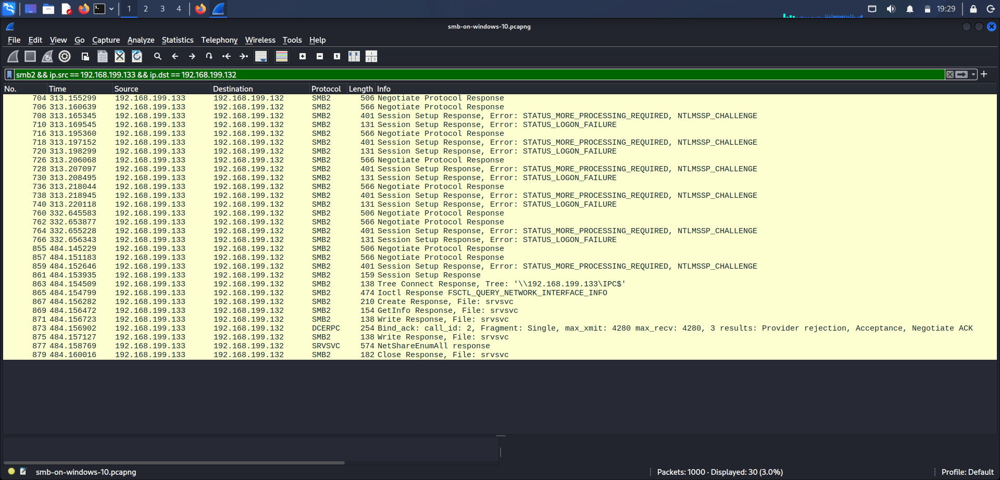
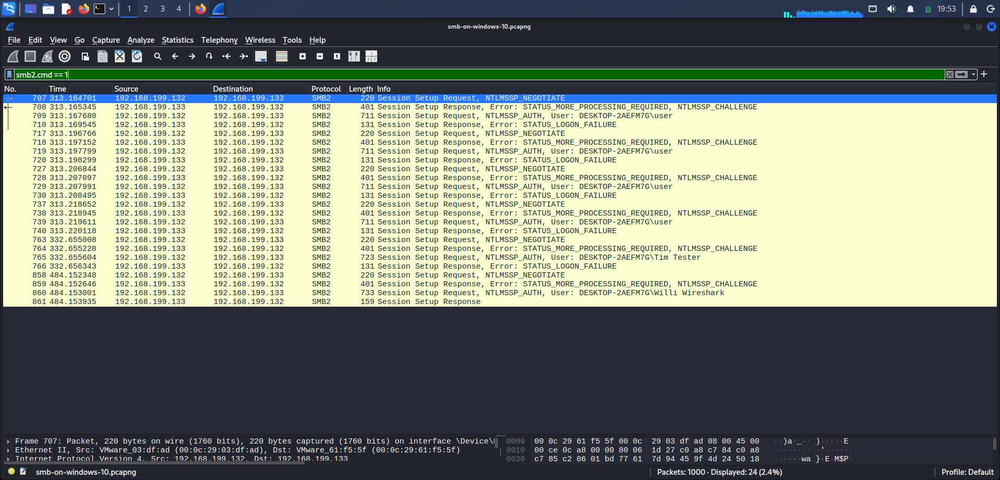
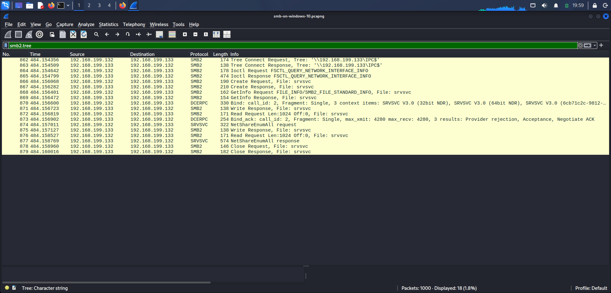
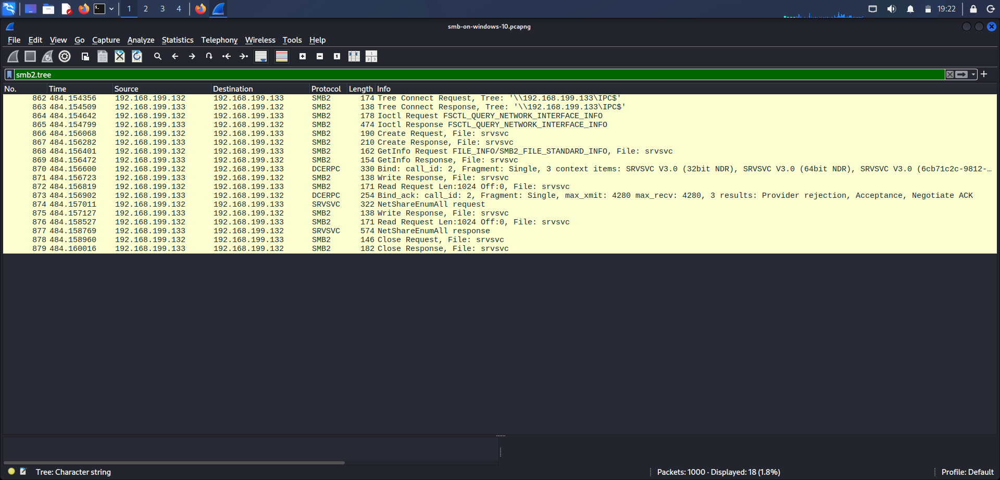
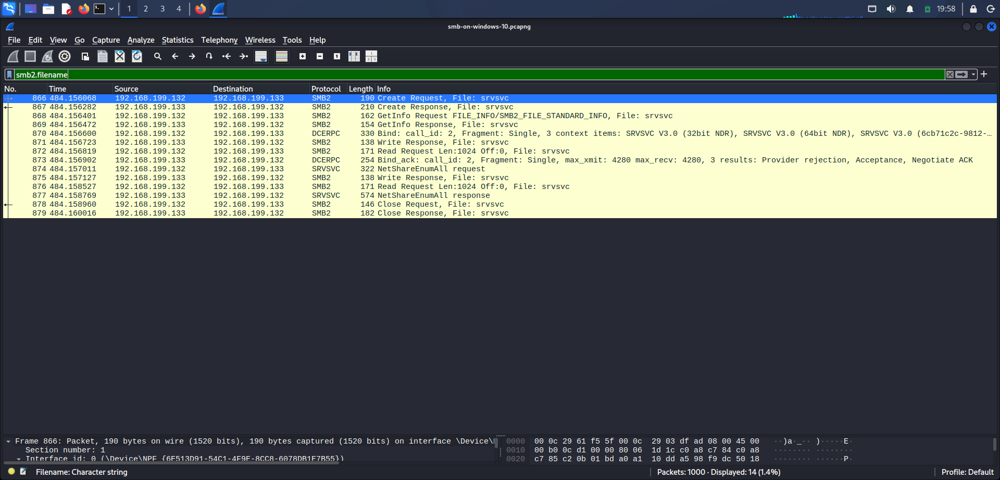

# Day 10 — SMB Authentication & Remote Share Enumeration Investigation

## Objective

Investigate SMB2 traffic between two internal Windows hosts to identify repeated authentication attempts, determine whether authentication was successful, and analyze activity performed after authentication.

The investigation focused on:

- Identifying the SMB client and server
- Analyzing NTLM authentication attempts
- Identifying failed authentication responses
- Confirming successful authentication
- Identifying the authenticated account
- Investigating IPC$ access
- Analyzing SRVSVC RPC activity
- Identifying remote share enumeration
- Establishing what the PCAP proves and what it does not prove

---

## PCAP Information

| Field | Detail |
|---|---|
| **PCAP** | `smb-on-windows-10.pcapng` |
| **Investigation Tool** | Wireshark |

**Source:** [smb-on-windows-10.pcapng](https://raw.githubusercontent.com/jasonlue/pcap/refs/heads/master/smb-on-windows-10.pcapng)

---

## Investigation Environment

- Kali Linux
- Wireshark
- `smb-on-windows-10.pcapng`

---

## 1. Initial Traffic Baseline

**Total packets:** 1,000

Primary unicast hosts observed: `192.168.199.1`, `192.168.199.132`, `192.168.199.133`.

The two hosts involved in the primary SMB investigation were `192.168.199.132` and `192.168.199.133`.

| Host | Packets | Bytes |
|---|---:|---:|
| `192.168.199.132` | 290 | 38,993 |
| `192.168.199.133` | 494 | 62,400 |

Broadcast and multicast addresses were also present (`192.168.199.255`, `224.0.0.22`, `224.0.0.252`, `239.255.255.250`, `255.255.255.255`) — not the primary focus of the investigation.

---

## 2. SMB Traffic Identification

Filter used:

```text
smb || smb2
```

**Result: 95 SMB/SMB2 packets.**

TCP port 445 filter:

```text
tcp.port == 445
```

**Result: 90 packets.** This confirmed the presence of SMB traffic over TCP/445.

**Evidence**


*Screenshot_2026-09-03_19_29_26.png — SMB/SMB2 traffic between 192.168.199.133 and 192.168.199.132, including repeated NTLM authentication failures and successful SMB session activity*

---

## 3. SMB2 Negotiation

SMB2 protocol negotiation was observed between `192.168.199.132` and `192.168.199.133`.

Frame 704 contained an SMB2 Negotiate Protocol Response:

```
Source:      192.168.199.133:445
Destination: 192.168.199.132

NT Status:      STATUS_SUCCESS
Command:        Negotiate Protocol
Security mode:  Signing enabled
Dialect:        SMB2 wildcard
Capabilities:   DFS, LEASING, LARGE MTU
```

The negotiated SMB2 capabilities included maximum read, write, and transaction sizes of 8 MB.

> `STATUS_SUCCESS` at this stage indicates successful SMB **protocol negotiation**. It does not indicate successful **user authentication** — those are two separate confirmations, and conflating them would overstate this step.

---

## 4. NTLM Authentication Analysis

Filter used:

```text
smb2.cmd == 1
```

This isolated SMB2 Session Setup messages. Repeated authentication sequences were observed:

```
NTLMSSP_NEGOTIATE
        ↓
NTLMSSP_CHALLENGE
        ↓
NTLMSSP_AUTH
        ↓
STATUS_LOGON_FAILURE
```

Multiple authentication attempts produced `STATUS_LOGON_FAILURE`. Usernames observed in authentication requests:

- `DESKTOP-2AEFM7G\user`
- `DESKTOP-2AEFM7G\Tim Tester`
- `DESKTOP-2AEFM7G\Willi Wireshark`

The repeated authentication failures indicate repeated attempts to authenticate to the SMB service.

**Evidence**


*Screenshot_2026-09-03_19_08_37.png — repeated SMB2 Session Setup and NTLM authentication exchanges, including multiple STATUS_LOGON_FAILURE responses*

---

## 5. Successful Authentication

A successful SMB authentication was identified in **Frame 861**:

```
SMB2 Session Setup Response
NT Status: STATUS_SUCCESS
```

The authenticated account was explicitly identified as:

```
Account: Willi Wireshark
Domain:  DESKTOP-2AEFM7G
Host:    DESKTOP-2AEFM7G
```

This provides direct evidence that the SMB authentication request associated with Willi Wireshark was accepted.

**Evidence**


*Screenshot_2026-09-04_19_53_07.png — repeated SMB2 NTLM authentication attempts, including STATUS_LOGON_FAILURE responses and the successful authentication attempt for Willi Wireshark*

---

## 6. Post-Authentication IPC$ Access

Immediately after the successful authentication, SMB2 Tree Connect activity was observed.

**Frame 862** — Tree Connect Request: `\\192.168.199.133\IPC$`
**Frame 863** — Tree Connect Response: `\\192.168.199.133\IPC$`

This confirms that the authenticated session accessed the remote IPC$ share on `192.168.199.133`.

**Evidence**


*Screenshot_2026-09-04_19_59_42.png — SMB2 tree activity confirming access to \\192.168.199.133\IPC$*

---

## 7. SRVSVC RPC Activity

Following IPC$ access, the session performed service and RPC-related operations:

```
FSCTL_QUERY_NETWORK_INTERFACE_INFO
Create Request, File: srvsvc
GetInfo Request, File: srvsvc
DCE/RPC Bind
SRVSVC
```

The communication then included a `NetShareEnumAll` request and response.

The srvsvc interface and `NetShareEnumAll` activity indicate that the authenticated client queried the remote system for available network shares.

**Evidence**


*Screenshot_2026-09-04_19_22_11(1).png — SMB2 IPC$ access followed by srvsvc and SRVSVC RPC activity, including NetShareEnumAll*

---

## 8. Remote Share Enumeration

Filter used:

```text
smb2.tree
```

This identified access to `\\192.168.199.133\IPC$`. The SRVSVC RPC traffic was then examined through `NetShareEnumAll`, indicating remote share enumeration activity against `192.168.199.133`, occurring after successful SMB authentication.

---

## 9. SMB File / Service Object Analysis

Filter used:

```text
smb2.filename
```

The capture showed activity involving `srvsvc`, with the observed sequence:

```
Create → GetInfo → Write → Read → Close
```

for the srvsvc object. The presence of srvsvc is associated with the Windows Server Service RPC interface used during the share enumeration activity observed in the capture.

**No evidence of a transferred `PSEXESVC.exe` executable was identified during this investigation.**

**Evidence**


*Screenshot_2026-09-04_19_58_46.png — SMB2 filename activity involving the srvsvc object, including Create, GetInfo, Read, Write, and Close operations*

---

## 10. Investigation Timeline

```
192.168.199.132
        |
        | SMB2 negotiation
        v
192.168.199.133:445
        |
        | NTLM authentication attempts
        |
        +---- STATUS_LOGON_FAILURE
        |
        +---- STATUS_LOGON_FAILURE
        |
        +---- STATUS_LOGON_FAILURE
        |
        +---- NTLMSSP_AUTH: Willi Wireshark
                  |
                  v
            STATUS_SUCCESS
                  |
                  v
              IPC$ access
                  |
                  v
              srvsvc access
                  |
                  v
              DCE/RPC Bind
                  |
                  v
           NetShareEnumAll
                  |
                  v
          Remote share enumeration
```

---

## 11. Findings

**Finding 1 — Repeated SMB Authentication Failures**
Multiple NTLM authentication attempts were observed against the SMB service, with repeated `STATUS_LOGON_FAILURE` responses — indicating repeated unsuccessful authentication activity.

**Finding 2 — Successful Authentication**
Frame 861 provides direct evidence of successful SMB authentication: `NT Status: STATUS_SUCCESS`, `Account: Willi Wireshark`, `Domain: DESKTOP-2AEFM7G`.

**Finding 3 — IPC$ Access After Authentication**
Following successful authentication, the session connected to `\\192.168.199.133\IPC$`, demonstrating authenticated IPC$ access to the remote host.

**Finding 4 — Remote Share Enumeration**
The authenticated session interacted with the srvsvc RPC interface and performed `NetShareEnumAll`, indicating that the client queried the remote system for available network shares.

---

## 12. Assessment

The PCAP shows repeated NTLM authentication failures followed by a successful authentication using the account `DESKTOP-2AEFM7G\Willi Wireshark`.

After authentication, the client accessed the remote IPC$ share and used the SRVSVC RPC interface to perform `NetShareEnumAll` share enumeration.

The repeated authentication failures followed by successful authentication are consistent with possible credential-guessing or automated authentication activity, but the PCAP alone does not establish the exact method used or prove that the activity was a brute-force attack.

The authenticated share-enumeration activity demonstrates remote network/share discovery. **No evidence of ADMIN$, PSEXESVC.exe, or remote service execution was identified in the investigated traffic.**

---

## 13. MITRE ATT&CK Mapping

| Tactic | Technique | ID |
|---|---|---|
| Credential Access | Brute Force | [T1110](https://attack.mitre.org/techniques/T1110/) |
| Lateral Movement | Remote Services: SMB/Windows Admin Shares | [T1021.002](https://attack.mitre.org/techniques/T1021/002/) |
| Discovery | Network Share Discovery | [T1135](https://attack.mitre.org/techniques/T1135/) |

- **T1110** — repeated failed NTLM authentication attempts were observed, followed by a successful authentication. The PCAP does not independently establish whether the failures were generated by a brute-force tool, password spraying, manual attempts, or another mechanism.
- **T1021.002** — SMB was used for authenticated communication with the Windows host. However, the investigation specifically observed **IPC$** and did not identify **ADMIN$** access. This mapping should be treated cautiously and should not be used as evidence of PsExec execution.
- **T1135** — the authenticated session performed `NetShareEnumAll` through the SRVSVC RPC interface, consistent with enumeration of network shares on the remote Windows host.

---

## 14. Limitations

The investigation was based solely on the network capture. The PCAP does not establish:

- The original source of the credentials
- Whether the password was guessed, reused, or obtained elsewhere
- The exact number of password attempts
- The password values
- Commands executed after authentication
- Whether files were accessed after share enumeration
- Whether remote code execution occurred
- Whether PsExec was used
- Whether the authentication activity was authorized

Endpoint telemetry and Windows security logs would be required to determine the authentication context and any subsequent host activity.

---

## 15. Conclusion

The investigation identified SMB2 authentication and remote discovery activity between `192.168.199.132 → 192.168.199.133:445`.

The capture contains repeated NTLM authentication failures followed by a successful authentication for `DESKTOP-2AEFM7G\Willi Wireshark`.

After authentication, the client connected to `\\192.168.199.133\IPC$` and interacted with the srvsvc RPC interface. The subsequent `NetShareEnumAll` operation demonstrates remote network-share enumeration.

The overall activity is consistent with suspicious SMB authentication followed by remote share discovery. The PCAP provides evidence of successful authentication and discovery activity, but it does not by itself prove brute-force tooling, privilege escalation, PsExec execution, or remote code execution.

---

## Evidence

| # | Screenshot | Content |
|---|---|---|
| 1 | `Screenshot_2026-09-03_19_06_26.png` | SMB/SMB2 traffic overview |
| 2 | `Screenshot_2026-09-03_19_08_37.png` | Repeated Session Setup / NTLM failures |
| 3 | `Screenshot_2026-09-04_19_53_07.png` | NTLM attempts including successful login |
| 4 | `Screenshot_2026-09-04_19_59_42.png` | SMB2 tree activity — IPC$ access |
| 5 | `Screenshot_2026-09-04_19_22_11(1).png` | IPC$/srvsvc/RPC activity, NetShareEnumAll |
| 6 | `Screenshot_2026-09-04_19_58_46.png` | SMB2 filename activity on srvsvc |


---

## Folder Structure

```
day10-smb-share-enum/
├── README.md
├── Screenshot_2026-09-03_19_06_26.png
├── Screenshot_2026-09-03_19_08_37.png
├── Screenshot_2026-09-04_19_22_11.png
├── Screenshot_2026-09-04_19_53_07.png
├── Screenshot_2026-09-04_19_58_46.png
└── Screenshot_2026-09-04_19_59_42.png
```

Do not commit `smb-on-windows-10.pcapng` itself — reference the source link instead.

---

## Disclaimer

This investigation was performed using a publicly available network traffic capture for cybersecurity education and defensive security training. The conclusions documented here are limited to the network evidence available in the PCAP and do not confirm brute-force tooling, privilege escalation, or remote code execution.
